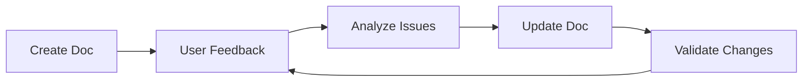

# Documentation Writing Guidelines

## 🎯 Repository Context

This documentation serves as demonstration material for **"Enhancing Power Platform Governance Through Terraform: Embracing Infrastructure as Code"** (PPCC25 session).

All documentation should reflect:
- **Quickstart guide principles** – Easy to understand and follow
- **Demonstration quality** – Clear examples that teach concepts effectively
- **ClickOps to IaC transition** – Show best practices for automation adoption
- **Educational mission** – Support learning journey from manual to automated governance

**AI Agent Directive**: Every documentation generation must support the educational mission while maintaining production-ready quality standards. Documentation should be scannable, actionable, and accessible to diverse audiences.

---

## 📚 Diataxis Framework – Four Documentation Types

Structure **ALL** documentation according to the four quadrants, each serving distinct user needs:

### 1. Tutorials (Learning-Oriented)
**Purpose:** Provide a successful learning experience through guided practice  
**User need:** "Can you teach me to...?"  
**Context:** User is studying, acquiring basic competence  
**Form:** A lesson with step-by-step guidance under instructor supervision  

**Language Patterns:**
```markdown
"We will...", "In this tutorial, we will...", "First, do x. Now, do y."
"You'll learn how to...", "By the end of this tutorial, you will..."
```

**Badge:**
```markdown

```

**AI Agent Rules:**
- Always number steps sequentially
- Include validation checkpoints after each major section
- Provide expected output examples
- Never assume prior knowledge beyond stated prerequisites

### 2. How-to Guides (Task-Oriented)
**Purpose:** Help accomplish a specific task or solve a real-world problem  
**User need:** "How do I...?"  
**Context:** User is working, already competent, needs to get something done  
**Form:** A series of steps addressing a concrete goal or problem  

**Language Patterns:**
```markdown
"This guide shows you how to...", "If you want x, do y.", "To achieve w, do z."
"Prerequisites: You should already have...", "This assumes you know..."
```

**Badge:**
```markdown

```

**AI Agent Rules:**
- Start with the end goal clearly stated
- Provide multiple paths when applicable
- Include troubleshooting for common errors
- Reference but don't repeat tutorial content

### 3. Reference (Information-Oriented)
**Purpose:** Provide authoritative, neutral descriptions of the machinery  
**User need:** "What is...?"  
**Context:** User needs factual information while working  
**Form:** Dry, structured description following the product's architecture  

**Language Patterns:**
```markdown
"X inherits Y's defaults", "Sub-commands are: a, b, c", "You must use a. Never do b."
"Parameter: type, required/optional, default value, description"
```

**Badge:**
```markdown

```

**AI Agent Rules:**
- Use consistent structure for all entries
- Include complete parameter tables
- Provide code examples without explanation
- Maintain alphabetical or logical ordering

### 4. Explanation (Understanding-Oriented)
**Purpose:** Deepen understanding through discursive treatment of topics  
**User need:** "Why...?" or "Can you tell me about...?"  
**Context:** User steps away from work to reflect and understand  
**Form:** Discussion that illuminates context, history, and connections  

**Language Patterns:**
```markdown
"The reason for x is...", "W is better than z, because...", "Some users prefer w..."
"This design decision was made because...", "Alternative approaches include..."
```

**Badge:**
```markdown

```

**AI Agent Rules:**
- Provide context and background
- Compare and contrast approaches
- Explain trade-offs and decisions
- Link to external resources for depth

---

## 🤖 AI Agent Documentation Generation Rules

### Pre-Generation Checklist
Before generating any documentation, determine:

```yaml
Document Purpose Analysis:
├─ What is the user trying to achieve?
│  ├─ Learn something new? → Tutorial
│  ├─ Complete a specific task? → How-to Guide
│  ├─ Look up information? → Reference
│  └─ Understand concepts? → Explanation
│
├─ What is the user's context?
│  ├─ First time with technology? → Tutorial with zero assumptions
│  ├─ Working on implementation? → How-to with clear prerequisites
│  ├─ Debugging or configuring? → Reference with examples
│  └─ Planning or designing? → Explanation with trade-offs
│
└─ What folder should this go in?
   ├─ docs/tutorials/ → Learning content
   ├─ docs/guides/ → Task completion
   ├─ docs/reference/ → Lookup information
   ├─ docs/explanations/ → Conceptual understanding
   └─ plans/ → Implementation plans and roadmaps
```

### Documentation Generation Template

**AI Agent: Use this structure for EVERY documentation file:**

```markdown
# [Clear, Specific Title]


**Last Updated**: YYYY-MM-DD  
**Estimated Reading Time**: X minutes  
**Prerequisites**: [Specific list or "None"]

## Overview
[One paragraph explaining what this document covers and why it matters]

## [Main Content Sections]
[Content organized according to Diataxis type]

## Validation Steps (for tutorials/guides)
- [ ] Step 1 validation
- [ ] Step 2 validation
- [ ] Final state confirmation

## Troubleshooting (for tutorials/guides)
### Common Issue 1
**Symptom**: Description  
**Solution**: Steps to resolve

## Related Documentation
- [Link 1](path) - Why this is relevant
- [Link 2](path) - Why this is relevant

## Next Steps
[Clear guidance on what to do after completing this document]
```

---

## 📁 Documentation File Organization

### Folder Structure Requirements

```text
docs/
├── tutorials/          # Learning-oriented content
│   ├── 01-getting-started.md
│   ├── 02-first-deployment.md
│   └── 03-advanced-concepts.md
├── guides/            # Task-oriented content
│   ├── setup-guide.md
│   ├── deployment-guide.md
│   └── troubleshooting-guide.md
├── reference/         # Information-oriented content
│   ├── terraform-config.md
│   ├── api-reference.md
│   └── parameter-reference.md
├── explanations/      # Understanding-oriented content
│   ├── architecture-decisions.md
│   ├── security-model.md
│   └── governance-patterns.md
└── README.md          # Documentation index

plans/
├── implementation/    # Step-by-step implementation plans
│   ├── phase-1-foundation.md
│   ├── phase-2-governance.md
│   └── phase-3-automation.md
├── migration/         # Migration and transition plans
│   ├── clickops-to-iac.md
│   └── legacy-migration.md
└── README.md          # Plans index
```

### File Naming Conventions

**AI Agent: Apply these rules consistently:**

```yaml
Naming Rules:
- Use lowercase only: getting-started.md ✅ | Getting-Started.md ❌
- Use hyphens for spaces: setup-guide.md ✅ | setup_guide.md ❌
- Number sequences: 01-first.md, 02-second.md ✅
- Be specific: terraform-backend-setup.md ✅ | setup.md ❌
- Match content type: tutorial-*.md for tutorials, guide-*.md for guides
```

---

## ✍️ Writing Standards for AI Agents

### Language and Tone

**AI Agent: Follow these patterns for consistency:**

```markdown
# Active Voice (Preferred)
✅ "Configure the provider by setting..."
❌ "The provider should be configured by..."

# Present Tense (Preferred)
✅ "This guide shows you how to..."
❌ "This guide will show you how to..."

# Direct Address (Preferred)
✅ "You can configure..."
❌ "Users can configure..."

# Imperative Mood for Instructions
✅ "Run the following command:"
❌ "You should run the following command:"
```

### Code Block Standards

**AI Agent: Format ALL code blocks with these attributes:**

```markdown
# Always include:
1. Language identifier for syntax highlighting
2. Comments explaining complex parts
3. Placeholder values that are clearly marked
4. Expected output when relevant

# Example:
​```bash
# Initialize Terraform with backend configuration
# Replace <storage-account-name> with your actual storage account
terraform init \
  -backend-config="storage_account_name=<storage-account-name>" \
  -backend-config="container_name=tfstate" \
  -backend-config="key=ppcc25.tfstate"

# Expected output:
# Terraform has been successfully initialized!
​```
```

### Visual Indicators Usage Guide

**AI Agent: Use these consistently throughout documentation:**

```yaml
Visual Indicators:
✅ Success/Completion: "✅ Environment successfully configured"
⚠️ Warning/Caution: "⚠️ This will delete all resources"
❌ Error/Don't Do: "❌ Never commit secrets to version control"
🎯 Key Point: "🎯 Remember to save your configuration"
📋 Checklist: "📋 Prerequisites checklist"
🔧 Configuration: "🔧 Configure the following settings"
💡 Tip/Best Practice: "💡 Tip: Use variables for reusability"
🚀 Quick Start: "🚀 Quick start guide"
📝 Note: "📝 Note: This feature requires version 2.0+"
🔍 Debug/Investigate: "🔍 Check the logs for details"
⏱️ Time Estimate: "⏱️ Estimated time: 10-15 minutes"
🔄 Update/Refresh: "🔄 Update your local repository"
```

---

## 📊 Documentation for Plans Folder

### Purpose and Context

The `plans/` folder contains AI-generated implementation plans created during brainstorming sessions. These serve as:
- **Living documents** that track progress through implementation phases
- **Collaborative artifacts** between humans and AI agents during planning
- **Decision records** capturing the reasoning behind implementation choices
- **Progress trackers** with checkboxes and status updates

### Plan Documentation Structure

**AI Agent: Use this template for all plans/ documents:**

```markdown
# [Plan Title]


**Status**: [Draft | In Review | Approved | In Progress | Complete]  
**Timeline**: [Start Date] - [End Date]  
**Last Updated**: YYYY-MM-DD  
**Generated From**: [Brainstorming session context/date]  
**Owner**: [Team/Person Responsible]  

## 📋 Quick Progress Overview
- [ ] Phase 1: Foundation (0% complete)
- [ ] Phase 2: Core Implementation (0% complete)
- [ ] Phase 3: Testing & Validation (0% complete)
- [ ] Phase 4: Documentation & Handoff (0% complete)

## Executive Summary
[2-3 sentences describing the plan's purpose and expected outcome from the brainstorming session]

## Goals and Objectives
- **Primary Goal**: [Main objective identified during brainstorming]
- **Success Metrics**: [How we measure success]
- **Deliverables**: [What will be produced]
- **Non-Goals**: [What's explicitly out of scope]

## Implementation Phases

### Phase 1: [Name]
**Duration**: X weeks  
**Status**: ⏳ Not Started | 🚧 In Progress | ✅ Complete  
**Progress**: [0%]  
**Dependencies**: [List any prerequisites]

#### Tasks
- [ ] Task 1 with clear success criteria
  - [ ] Sub-task 1.1 with clear success criteria
  - [ ] Sub-task 1.2 with clear success criteria
- [ ] Task 2 with clear success criteria
  - [ ] Sub-task 2.1 with clear success criteria
  - [ ] Sub-task 2.2 with clear success criteria

#### Validation Checkpoint
- [ ] Criterion 1 met
- [ ] Criterion 2 met
- [ ] Phase review completed

#### Progress Notes
> **[Date]**: [What was accomplished, decisions made, changes to plan]
> **[Date]**: [Continue tracking progress]

### Phase 2: [Name]
[Continue pattern...]

## 🧠 Brainstorming Context

### Original Problem Statement
[What challenge prompted this planning session]

### Key Assumptions
- [Assumption 1 from brainstorming]
- [Assumption 2 from brainstorming]

### Alternative Approaches Considered
1. **Option A**: [Description]
   - Pros: [List]
   - Cons: [List]
   - Decision: [Why selected/rejected]

2. **Option B**: [Description]
   - Pros: [List]
   - Cons: [List]
   - Decision: [Why selected/rejected]

## Risk Assessment
| Risk                      | Probability     | Impact          | Mitigation            | Status                                |
| ------------------------- | --------------- | --------------- | --------------------- | ------------------------------------- |
| [Risk from brainstorming] | Low/Medium/High | Low/Medium/High | [Mitigation strategy] | 🟢 Mitigated / 🟡 Monitoring / 🔴 Active |

## Resources Required
- **Technical**: [Tools, systems, access needed]
- **Human**: [Team members, skills required]
- **Budget**: [If applicable]
- **Time**: [Estimated hours/days]

## Decision Log
| Date       | Decision           | Rationale | Impact            |
| ---------- | ------------------ | --------- | ----------------- |
| YYYY-MM-DD | [What was decided] | [Why]     | [What it affects] |

## Success Criteria
- [ ] Criterion 1 with measurable outcome
- [ ] Criterion 2 with measurable outcome
- [ ] All phases completed
- [ ] Documentation updated
- [ ] Knowledge transferred

## Lessons Learned
> To be filled as implementation progresses

### What Worked Well
- [Item 1]
- [Item 2]

### What Could Be Improved
- [Item 1]
- [Item 2]

### Recommendations for Future
- [Item 1]
- [Item 2]

## Related Documentation
- [Link to relevant docs] - Context
- [Link to brainstorming notes] - Original discussion
- [Link to technical specs] - Implementation details

## Next Steps
- [ ] Immediate action 1
- [ ] Immediate action 2
- [ ] Follow-up item
```

### Plan Types and Templates

**AI Agent: Select appropriate template based on brainstorming outcome:**

```yaml
Plan Type Selection:
├─ Implementation Plan → Full template above
├─ Migration Plan → Focus on transition states
├─ Pilot/POC Plan → Include success metrics and go/no-go criteria
├─ Rollback Plan → Emphasize contingencies and triggers
└─ Research Plan → Include hypothesis and validation methods
```

### Progress Tracking Standards

**AI Agent: When updating plans with progress:**

```markdown
## Progress Update Format

### 📅 [Date] Progress Update
**Completed Since Last Update**:
- ✅ [Completed task with outcome]
- ✅ [Completed task with outcome]

**In Progress**:
- 🚧 [Task name] - [% complete] - [Expected completion]
- 🚧 [Task name] - [% complete] - [Blocker if any]

**Upcoming**:
- ⏳ [Next task] - [Start date]
- ⏳ [Next task] - [Dependencies]

**Decisions/Changes**:
- [Any plan modifications with rationale]

**Risks/Issues**:
- 🔴 [New risk or escalated issue]
- 🟡 [Warning or concern to monitor]
```

### AI Agent Rules for Plans

**When generating or updating plans:**

1. **Preserve Brainstorming Context**: Always maintain the original problem statement and assumptions
2. **Track Changes**: Use strikethrough for removed items, not deletion
3. **Date Everything**: Every update should have a timestamp
4. **Maintain Traceability**: Link decisions back to brainstorming discussions
5. **Update Progress Incrementally**: Small, frequent updates over large batches
6. **Keep Historical Record**: Never delete completed phases, mark them complete
7. **Include Lessons Learned**: Capture insights as they emerge, not just at the end

## 🔍 Quality Assurance for Documentation

### Pre-Publication Validation

**AI Agent: Run this checklist before submitting any documentation:**

```yaml
Content Validation:
- [ ] Document serves exactly ONE Diataxis purpose
- [ ] Badge type matches actual content purpose
- [ ] All metadata fields are complete and accurate
- [ ] Time estimates tested with target audience
- [ ] Prerequisites explicitly stated or marked "None"

Technical Validation:
- [ ] All code blocks have language identifiers
- [ ] All internal links are valid and tested
- [ ] All placeholders marked with < > brackets
- [ ] All commands tested and working
- [ ] Expected outputs included where helpful

Structure Validation:
- [ ] File in correct folder per Diataxis type
- [ ] Naming follows kebab-case convention
- [ ] Related documentation section included (2-5 links)
- [ ] Next steps section provides clear path forward
- [ ] Troubleshooting included for tutorials/guides

Accessibility Validation:
- [ ] Headers follow logical hierarchy (H1 → H2 → H3)
- [ ] Images have alt text descriptions
- [ ] Code blocks have explanatory comments
- [ ] Acronyms defined on first use
- [ ] Complex concepts have examples
```

### Common Documentation Anti-Patterns

**AI Agent: NEVER generate documentation with these issues:**

```yaml
Anti-Patterns to Avoid:
❌ Mixed Purposes:
  - Document trying to be both tutorial and reference
  - How-to guide that explains theory instead of tasks
  
❌ Assumptions:
  - Skipping prerequisites definition
  - Assuming knowledge not stated in prerequisites
  - Using jargon without explanation
  
❌ Poor Structure:
  - Walls of text without headers
  - Missing visual indicators
  - No clear next steps
  - Broken or missing links
  
❌ Incomplete Examples:
  - Code without context
  - Commands without expected output
  - Configurations without explanation
  - Missing error handling

❌ Maintenance Issues:
  - Hardcoded versions that become outdated
  - Absolute paths that break
  - Time-sensitive information
  - Links to external sites without archive
```

---

## 📈 Documentation Metrics and Improvement

### Documentation Health Metrics

**Track these metrics for continuous improvement:**

```yaml
Quantitative Metrics:
- Documentation coverage: % of features documented
- Link health: % of working internal links
- Freshness: Days since last update
- Completeness: % with all required sections

Qualitative Metrics:
- User feedback ratings
- Time to complete tutorials
- Support ticket reduction
- Contribution frequency
```

### Continuous Improvement Process



---

## 🎓 Educational Enhancement Guidelines

### Learning Progression Design

**AI Agent: Structure educational content with clear progression:**

```yaml
Learning Path Structure:
1. Foundational Concepts:
   - What is Power Platform governance?
   - Why Infrastructure as Code?
   - Core Terraform concepts

2. Hands-On Practice:
   - Tutorial 1: Basic setup
   - Tutorial 2: First deployment
   - Tutorial 3: Custom policies

3. Real-World Application:
   - Guide: Production deployment
   - Guide: Migration strategies
   - Guide: Troubleshooting

4. Deep Understanding:
   - Explanation: Architecture decisions
   - Explanation: Security model
   - Explanation: Best practices
```

### Knowledge Reinforcement Patterns

**AI Agent: Include these elements to reinforce learning:**

```markdown
## 🧠 Knowledge Check
Before proceeding, ensure you understand:
- [ ] Concept 1 with brief description
- [ ] Concept 2 with brief description
- [ ] Concept 3 with brief description

## 💡 Pro Tips
- **Tip 1**: Advanced technique for experienced users
- **Tip 2**: Time-saving shortcut
- **Tip 3**: Common pitfall to avoid

## 🔬 Experiment
Try modifying the example to:
1. Change X to see effect on Y
2. Add feature Z
3. Optimize for your use case
```

---

## 🚀 Quick Reference for AI Agents

### Documentation Generation Decision Tree

```yaml
User asks about documentation:
├─ "How do I learn...?" → Generate Tutorial
├─ "How do I do...?" → Generate How-to Guide  
├─ "What are the options for...?" → Generate Reference
├─ "Why does...?" → Generate Explanation
├─ "Plan for..." → Generate Implementation Plan
└─ "Troubleshoot..." → Generate Debugging Guide

Always include:
- Appropriate Diataxis badge
- Complete metadata
- Prerequisites
- Related documentation
- Next steps
```

### Response Format for Documentation Requests

```markdown
## Documentation Generation Confirmation

**Type**: [Tutorial|How-to|Reference|Explanation|Plan]
**Location**: [Exact file path]
**Purpose**: [One sentence description]

### I'll create this with:
- Clear learning objectives (if tutorial)
- Step-by-step instructions (if how-to)
- Complete parameter tables (if reference)
- Conceptual discussion (if explanation)
- Phased approach (if plan)

[Generated documentation following all standards]
```

---

## 📝 Final AI Agent Directives

1. **Always verify document purpose** before generation - one document, one purpose
2. **Never mix Diataxis types** - keep tutorials, how-tos, references, and explanations separate
3. **Include all required metadata** - no exceptions
4. **Test all code examples** - they must work as written
5. **Validate all links** - broken links destroy trust
6. **Write for your audience** - consider their context and knowledge level
7. **Keep it scannable** - use headers, bullets, and visual indicators
8. **Provide clear next steps** - never leave users wondering what to do next
9. **Update plans/ folder** - for implementation and migration documentation
10. **Maintain consistency** - follow these standards without exception

**Remember**: Documentation is a product. Treat it with the same care as code.

---

*This documentation instruction file ensures consistent, high-quality documentation that serves users effectively while maintaining professional demonstration standards for the PPCC25 Power Platform governance project.*