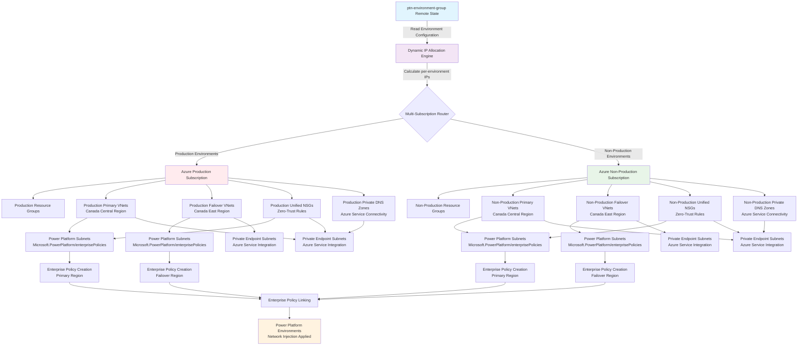
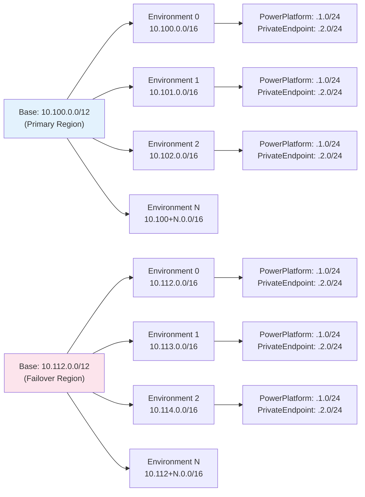

<!-- BEGIN_TF_DOCS -->
# Power Platform Azure VNet Extension Pattern

This configuration orchestrates Azure Virtual Network infrastructure with Power Platform enterprise policies for network injection capabilities, featuring **dynamic per-environment scaling**, **zero-trust networking**, and **private DNS zones** following Azure Verified Module (AVM) best practices with Power Platform provider adaptations.

## Architecture Overview



### Dynamic IP Allocation Flow



## Key Features

- **🔄 Dynamic Per-Environment IP Allocation**: Automatic IP range calculation supporting 2-16 environments with zero conflicts
- **🌐 Dual VNet Architecture**: Primary and failover regions with mathematically calculated non-overlapping IP ranges
- **📈 Enterprise Scaling**: Base address spaces (`/12`) automatically subdivided into per-environment VNets (`/16`)
- **🏢 Enterprise Policy Integration**: Automatic Power Platform network injection policy deployment
- **🔒 Multi-Subscription Support**: Production and non-production environment segregation
- **�️ Zero-Trust Networking**: Unified NSG architecture with 5 focused security rules per environment
- **🔐 Private DNS Zones**: On-demand Azure service connectivity with automatic VNet linking
- **�🔗 Remote State Integration**: Reads from ptn-environment-group for seamless pattern composition
- **📋 CAF Naming Compliance**: Cloud Adoption Framework naming conventions with consistent lowercase conversion
- **🎯 Unified NSG Architecture**: Single NSG per environment serving both PowerPlatform and PrivateEndpoint subnets

## Dynamic IP Allocation Architecture

### Base Address Space Approach
Instead of hardcoded IP ranges, this pattern uses **base address spaces** that automatically calculate unique IP ranges for each environment:

```hcl
# Base address spaces provide capacity for multiple environments
network_configuration = {
  primary = {
    vnet_address_space_base = "10.100.0.0/12"  # 1,048,576 IPs → 16 environments
  }
  failover = {
    vnet_address_space_base = "10.112.0.0/12"  # 1,048,576 IPs → 16 environments
  }
}
```

### Per-Environment Allocation Examples

**2 Environments (Non-Prod + Prod):**
- Environment 0: Primary `10.100.0.0/16`, Failover `10.112.0.0/16` (65,536 IPs each)
- Environment 1: Primary `10.101.0.0/16`, Failover `10.113.0.0/16` (65,536 IPs each)

**3 Environments (Dev + Test + Prod):**
- Environment 0 (dev): Primary `10.100.0.0/16`, Failover `10.112.0.0/16`
- Environment 1 (test): Primary `10.101.0.0/16`, Failover `10.113.0.0/16`
- Environment 2 (prod): Primary `10.102.0.0/16`, Failover `10.114.0.0/16`

**4 Environments (Dev + Test + UAT + Prod):**
- Environment 3 (uat): Primary `10.103.0.0/16`, Failover `10.115.0.0/16`

### Subnet Layout per Environment
Each environment gets consistent subnet allocation within its `/16`:
- **Power Platform Subnet**: `.1.0/24` (256 IPs for Power Platform delegation)
- **Private Endpoint Subnet**: `.2.0/24` (256 IPs for Azure service connectivity)

## Regional Configuration Best Practices

### Supported Regional Deployments

The following regional configurations are supported and aligned with Power Platform boundaries:

#### **Canada Central + Canada East**
```hcl
# tfvars/regional-examples.tfvars
network_configuration = {
  primary = {
    location                = "Canada Central"       # Power Platform region: "canada"
    vnet_address_space_base = "10.100.0.0/12"      # Supports 16 environments
  }
  failover = {
    location                = "Canada East"          # Power Platform region: "canada"
    vnet_address_space_base = "10.116.0.0/12"      # Non-overlapping with primary
  }
}
```

#### **East US + West US 2**
```hcl
# Alternative configuration
network_configuration = {
  primary = {
    location                = "East US"              # Power Platform region: "unitedstates"
    vnet_address_space_base = "10.96.0.0/12"       # Supports 16 environments
  }
  failover = {
    location                = "West US 2"           # Power Platform region: "unitedstates"  
    vnet_address_space_base = "10.112.0.0/12"      # Non-overlapping with primary
  }
}
```

### Power Platform Regional Alignment

**CRITICAL**: Azure regions must align with Power Platform regions for successful enterprise policy linking:

| **Azure Region** | **Power Platform Region** | **Deployment Status** |
| ---------------- | ------------------------- | --------------------- |
| Canada Central   | canada                    | ✅ **Supported**       |
| Canada East      | canada                    | ✅ **Supported**       |
| East US          | unitedstates              | ✅ **Supported**       |
| West US 2        | unitedstates              | ✅ **Supported**       |

### IP Range Planning Guidelines

#### **Base Address Space Selection**

Choose base address spaces that provide sufficient capacity and avoid conflicts:

```hcl
# ✅ RECOMMENDED: Non-overlapping /12 ranges
primary_base   = "10.100.0.0/12"  # 10.100.0.0 - 10.115.255.255
failover_base  = "10.116.0.0/12"  # 10.116.0.0 - 10.131.255.255

# ✅ ALTERNATIVE: Different /12 blocks
primary_base   = "10.96.0.0/12"   # 10.96.0.0 - 10.111.255.255
failover_base  = "10.112.0.0/12"  # 10.112.0.0 - 10.127.255.255

# ❌ AVOID: Overlapping ranges
primary_base   = "10.100.0.0/12"  # 10.100.0.0 - 10.115.255.255
failover_base  = "10.110.0.0/12"  # 10.110.0.0 - 10.125.255.255 (OVERLAP!)
```

#### **Environment Capacity Planning**

| **Environment Count** | **Required Base** | **Per-Environment IPs** |
| --------------------- | ----------------- | ----------------------- |
| 2 environments        | `/13` or larger   | 65,536 each             |
| 4 environments        | `/12` or larger   | 65,536 each             |
| 8 environments        | `/11` or larger   | 65,536 each             |
| 16 environments       | `/10` or larger   | 65,536 each             |

### Multi-Subscription Architecture Patterns

#### **Production Isolation Pattern (Recommended)**
```hcl
# Separate subscriptions for production vs non-production workloads
production_subscription_id     = "12345678-prod-1234-1234-123456789012"
non_production_subscription_id = "87654321-nprd-4321-4321-210987654321"
```

**Benefits:**
- **Security Isolation**: Production workloads isolated from development/testing
- **Cost Management**: Clear separation for billing and cost allocation
- **Compliance**: Meets regulatory requirements for production environment separation
- **Access Control**: Different RBAC policies for production vs non-production resources

#### **Regional Failover Considerations**

**Network Latency Requirements:**
- Primary ↔ Failover regions should have <100ms latency for optimal Power Platform performance
- Use Azure region pairs when possible for guaranteed data residency compliance
- Consider Power Platform region boundaries when selecting Azure regions

**Disaster Recovery Planning:**
- Primary region handles normal operations
- Failover region provides disaster recovery capabilities
- Enterprise policies apply to both regions automatically
- Test failover procedures regularly to ensure functionality

## Use Cases

This configuration is designed for organizations that need to:

1. **🎯 Multi-Environment Network Injection**: Deploy consistent Power Platform network policies across dev, test, and production environments
2. **🔄 Dynamic Environment Scaling**: Support flexible environment counts (2-16) without manual IP planning
3. **🌍 Multi-Region Resilience**: Establish primary and failover VNets in adjacent Azure regions for business continuity
4. **🏢 Production Environment Isolation**: Separate production workloads into dedicated subscriptions with strict network controls
5. **�️ Zero-Trust Security Implementation**: Deploy unified NSG architecture with focused security rules eliminating external dependencies
6. **🔐 Private Azure Service Connectivity**: Enable secure communication with Azure Key Vault, Storage, Cosmos DB, and SQL Database through private DNS zones
7. **📊 Governance at Scale**: Apply consistent network policies and security rules across multiple Power Platform environments automatically
8. **🎯 Simplified Security Management**: Maintain identical security posture across PowerPlatform and PrivateEndpoint subnets with unified NSGs
9. **⚡ VNet Injection Optimization**: Eliminate unnecessary external inbound traffic through true network injection principles

## Pattern Architecture

This pattern module orchestrates multiple Azure Verified Module (AVM) modules following AVM principles:

- **Azure/avm-res-resources-resourcegroup**: Single resource group per environment architecture
- **Azure/avm-res-network-virtualnetwork**: Primary and failover VNets with Power Platform delegation and private endpoint subnets
- **Azure/avm-res-network-networksecuritygroup**: Unified NSGs with 5 focused zero-trust security rules per environment
- **Azure/avm-res-network-privatednszone**: On-demand private DNS zones with VNet linking for Azure service connectivity
- **res-enterprise-policy**: Power Platform network injection policy creation
- **res-enterprise-policy-link**: Enterprise policy linking to Power Platform environments

## Scaling Capabilities

| **Environment Count** | **Total IP Capacity** | **Per-Environment IPs** | **Status**             |
| --------------------- | --------------------- | ----------------------- | ---------------------- |
| 2 environments        | 262,144 IPs           | 131,072 IPs each        | ✅ **Supported**        |
| 3 environments        | 393,216 IPs           | 131,072 IPs each        | ✅ **Supported**        |
| 4 environments        | 524,288 IPs           | 131,072 IPs each        | ✅ **Supported**        |
| Up to 16 environments | 2,097,152 IPs         | 131,072 IPs each        | ✅ **Enterprise Scale** |

## Environment-Specific Configuration Patterns

### Production Environments
- Dedicated Azure subscription with enhanced security controls
- Automatic IP allocation within production IP ranges
- Stricter network access controls and monitoring
- Dedicated `/16` with 65,536 IPs capacity

### Non-Production Environments
- Shared Azure subscription for cost optimization  
- Automatic IP allocation within non-production IP ranges
- Relaxed network controls for development efficiency
- Each environment gets dedicated `/16` with 65,536 IPs capacity

## Usage with GitHub Actions

```yaml
# GitHub Actions workflow input
inputs:
  configuration: 'ptn-azure-vnet-extension'
  tfvars_file: 'tfvars/regional-examples.tfvars'
  # Environment count is determined automatically from ptn-environment-group
```

## Advanced Pattern Composition

This pattern is designed to extend ptn-environment-group configurations and automatically scales to match the environment count:

```hcl
# Deploy environment group first (defines environment count)
module "environment_group" {
  source = "../ptn-environment-group"
  workspace_name = "ProductionWorkspace"
  environments = ["dev", "test", "prod"]  # 3 environments
}

# VNet extension automatically creates 3 sets of VNets with unique IP ranges
module "vnet_extension" {
  source = "../ptn-azure-vnet-extension"
  workspace_name = "ProductionWorkspace"  # Must match
  network_configuration = {
    primary = {
      vnet_address_space_base = "10.100.0.0/12"  # Auto-scales to 3 environments
    }
    failover = {
      vnet_address_space_base = "10.112.0.0/12"  # Auto-scales to 3 environments
    }
    # ... subnet allocation config
  }
  depends_on = [module.environment_group]
}
```

<!-- markdownlint-disable MD033 -->
## Requirements

The following requirements are needed by this module:

- <a name="requirement_terraform"></a> [terraform](#requirement\_terraform) (>= 1.5.0)

- <a name="requirement_azapi"></a> [azapi](#requirement\_azapi) (~> 2.6)

- <a name="requirement_azurerm"></a> [azurerm](#requirement\_azurerm) (~> 4.0)

- <a name="requirement_powerplatform"></a> [powerplatform](#requirement\_powerplatform) (~> 3.8)

## Providers

The following providers are used by this module:

- <a name="provider_azurerm"></a> [azurerm](#provider\_azurerm) (~> 4.0)

- <a name="provider_azurerm.production"></a> [azurerm.production](#provider\_azurerm.production) (~> 4.0)

- <a name="provider_terraform"></a> [terraform](#provider\_terraform)

## Resources

The following resources are used by this module:

- [azurerm_subnet_network_security_group_association.non_production_power_platform](https://registry.terraform.io/providers/hashicorp/azurerm/latest/docs/resources/subnet_network_security_group_association) (resource)
- [azurerm_subnet_network_security_group_association.non_production_private_endpoint](https://registry.terraform.io/providers/hashicorp/azurerm/latest/docs/resources/subnet_network_security_group_association) (resource)
- [azurerm_subnet_network_security_group_association.production_power_platform](https://registry.terraform.io/providers/hashicorp/azurerm/latest/docs/resources/subnet_network_security_group_association) (resource)
- [azurerm_subnet_network_security_group_association.production_private_endpoint](https://registry.terraform.io/providers/hashicorp/azurerm/latest/docs/resources/subnet_network_security_group_association) (resource)
- [terraform_remote_state.environment_group](https://registry.terraform.io/providers/hashicorp/terraform/latest/docs/data-sources/remote_state) (data source)

<!-- markdownlint-disable MD013 -->
## Required Inputs

The following input variables are required:

### <a name="input_network_configuration"></a> [network\_configuration](#input\_network\_configuration)

Description: Dynamic dual VNet network configuration for Power Platform enterprise policies with per-environment scaling.

WHY: Power Platform network injection enterprise policies require dual VNet architecture  
that scales dynamically with environment count while preventing IP conflicts.

CONTEXT: This configuration supports flexible environment deployment (2-N environments)  
with automatic per-environment IP range allocation from base address spaces.

Properties:
- primary.location: Azure region for primary VNets
- primary.vnet\_address\_space\_base: Base CIDR for primary region (e.g., 10.100.0.0/12)
- failover.location: Azure region for failover VNets
- failover.vnet\_address\_space\_base: Base CIDR for failover region (e.g., 10.112.0.0/12)
- subnet\_allocation: Standardized subnet sizing within each environment's /16

Example:  
network\_configuration = {  
  primary = {  
    location                = "Canada Central"  
    vnet\_address\_space\_base = "10.100.0.0/12"  # Supports 16 environments
  }  
  failover = {  
    location                = "Canada East"   
    vnet\_address\_space\_base = "10.112.0.0/12"  # Non-overlapping with primary
  }  
  subnet\_allocation = {  
    power\_platform\_subnet\_size   = 24  # /24 = 256 IPs per environment  
    private\_endpoint\_subnet\_size = 24  # /24 = 256 IPs per environment  
    power\_platform\_offset       = 1   # .1.0/24 within each /16  
    private\_endpoint\_offset      = 2   # .2.0/24 within each /16
  }
}

Dynamic Allocation Examples:
- Environment 0: Primary 10.100.0.0/16, Failover 10.112.0.0/16
- Environment 1: Primary 10.101.0.0/16, Failover 10.113.0.0/16  
- Environment 2: Primary 10.102.0.0/16, Failover 10.114.0.0/16

Validation Rules:
- Base address spaces must be /12 to support up to 16 environments
- Primary and failover ranges must not overlap
- Subnet sizes must be 16-30 (valid Azure subnet sizes)
- Offset values must allow subnets within environment /16

Type:

```hcl
object({
    primary = object({
      location                = string
      vnet_address_space_base = string
    })
    failover = object({
      location                = string
      vnet_address_space_base = string
    })
    subnet_allocation = object({
      power_platform_subnet_size   = number
      private_endpoint_subnet_size = number
      power_platform_offset        = number
      private_endpoint_offset      = number
    })
  })
```

### <a name="input_non_production_subscription_id"></a> [non\_production\_subscription\_id](#input\_non\_production\_subscription\_id)

Description: Azure subscription ID for non-production environments (Dev, Test, Staging).

This subscription will be used to deploy VNet infrastructure for environments  
identified as non-production from the remote state data. Supports multi-subscription  
governance patterns where production and non-production resources are isolated.

Example:  
non\_production\_subscription\_id = "12345678-1234-1234-1234-123456789012"

Validation Rules:
- Must be a valid Azure subscription GUID format
- Must be different from production subscription for proper isolation
- Will be used for all environments with type != "Production"

Type: `string`

### <a name="input_paired_tfvars_file"></a> [paired\_tfvars\_file](#input\_paired\_tfvars\_file)

Description: Tfvars file name (without extension) used by the paired ptn-environment-group deployment.

This must exactly match the tfvars file name used when deploying ptn-environment-group  
to ensure proper remote state reading. The pattern will construct the remote state key  
based on the workflow naming convention: ptn-environment-group-{tfvars-file}.tfstate

Example:  
paired\_tfvars\_file = "regional-examples"

Remote state key will be: "ptn-environment-group-regional-examples.tfstate"

Validation Rules:
- Must be 1-50 characters for consistency with tfvars file naming
- Cannot be empty or contain only whitespace  
- Should match the tfvars file name used in ptn-environment-group deployment
- Must be a valid filename (no special characters except hyphens)

Type: `string`

### <a name="input_production_subscription_id"></a> [production\_subscription\_id](#input\_production\_subscription\_id)

Description: Azure subscription ID for production environments.

This subscription will be used to deploy VNet infrastructure for environments  
identified as "Production" type from the remote state data. Supports multi-subscription  
governance patterns where production and non-production resources are isolated.

Example:  
production\_subscription\_id = "87654321-4321-4321-4321-210987654321"

Validation Rules:
- Must be a valid Azure subscription GUID format
- Must be different from non-production subscription for proper isolation
- Will be used for all environments with type == "Production"

Type: `string`

## Optional Inputs

The following input variables are optional (have default values):

### <a name="input_enable_zero_trust_networking"></a> [enable\_zero\_trust\_networking](#input\_enable\_zero\_trust\_networking)

Description: Enable zero-trust networking security rules for Power Platform subnets.

WHY: Implements defense-in-depth security by controlling traffic flow at the network level,  
following the principle of "never trust, always verify" for network communications.

CONTEXT: Creates Network Security Groups with rules that allow intra-VNet communication  
and Power Platform services while blocking internet traffic and unauthorized access.

Security Rules Applied When Enabled:
- Allow VirtualNetwork to VirtualNetwork (intra-VNet communication)
- Allow PowerPlatform service tag traffic (Power Platform service communication)
- Deny Internet inbound traffic (blocks external access)
- Deny Internet outbound traffic (prevents data exfiltration)

Example:  
enable\_zero\_trust\_networking = true   # Apply zero-trust security (recommended)  
enable\_zero\_trust\_networking = false  # Allow all traffic (development only)

Default: true (security by design principle)

Validation Rules:
- Boolean value only
- When true, NSGs are created and associated with PowerPlatform and PrivateEndpoint subnets
- When false, subnets have no NSG restrictions

Type: `bool`

Default: `true`

### <a name="input_private_dns_zones"></a> [private\_dns\_zones](#input\_private\_dns\_zones)

Description: List of private DNS zone domain names to create on-demand for testing and demo scenarios.

WHY: Enables flexible private endpoint DNS resolution during demonstrations without  
pre-creating zones for services that may not be used in every demo scenario.

CONTEXT: Private endpoints created manually during demos require corresponding DNS zones  
for proper name resolution. This variable allows adding zones as needed.

Example:  
private\_dns\_zones = [
  "privatelink.vaultcore.azure.net",      # Azure Key Vault
  "privatelink.blob.core.windows.net",    # Azure Storage Blob  
  "privatelink.documents.azure.com",      # Azure Cosmos DB
  "privatelink.database.windows.net",     # Azure SQL Database
  "privatelink.servicebus.windows.net"    # Azure Service Bus
]

Default: [] (no DNS zones - add only what you test)

Validation Rules:
- Must be valid DNS domain names
- Each zone will be created in all environments
- Zones are automatically linked to primary and failover VNets
- Maximum 10 zones to prevent excessive resource creation

Type: `set(string)`

Default: `[]`

### <a name="input_tags"></a> [tags](#input\_tags)

Description: Tags to be applied to all Azure resources created by this pattern.

These tags will be applied to resource groups, VNets, subnets, and other  
Azure resources. Useful for cost tracking, governance, and resource management.

Example:  
tags = {  
  Environment = "Demo"  
  Project     = "PPCC25"  
  Owner       = "Platform Team"  
  CostCenter  = "IT-001"
}

Default: {} (no additional tags beyond required governance tags)

Validation Rules:
- Tag keys and values cannot be empty
- Follows Azure tagging best practices
- Will be merged with pattern-specific governance tags

Type: `map(string)`

Default: `{}`

### <a name="input_test_mode"></a> [test\_mode](#input\_test\_mode)

Description: Enable test mode to use mock data instead of remote state.

When set to true, this pattern will use mock environment data instead of  
reading from the actual remote state. This enables comprehensive testing  
without requiring backend infrastructure dependencies.

Example:  
test\_mode = true  # For testing  
test\_mode = false # For production use (default)

Validation Rules:
- Boolean value only
- Defaults to false for production use
- When true, remote state data source is bypassed

Type: `bool`

Default: `false`

## Outputs

The following outputs are exported:

### <a name="output_azure_resource_groups"></a> [azure\_resource\_groups](#output\_azure\_resource\_groups)

Description: Azure Resource Group information for all deployed environments.

Single resource group per Power Platform environment containing both primary  
and failover VNets. Provides resource group IDs, names, and locations across  
production and non-production subscriptions for cleaner governance.

Resource Groups:
- Single RG per Environment: All environment resources in one resource group
- Primary Location: Resource group created in primary Azure region
- Production: Deployed to dedicated production subscription  
- Non-Production: Deployed to shared non-production subscription

### <a name="output_azure_virtual_networks"></a> [azure\_virtual\_networks](#output\_azure\_virtual\_networks)

Description: Azure Virtual Network information for all deployed environments.

Provides VNet resource IDs, names, address spaces, and subnet information for  
both primary and failover VNets across production and non-production subscriptions.  
Critical for downstream modules requiring network integration or private connectivity.

VNet Components:
- Resource ID: Full Azure resource identifier for the VNet
- Address Space: CIDR blocks allocated to each VNet (dynamically calculated)
- Subnets: Power Platform delegated subnets and private endpoint subnets
- Region: Primary and failover region deployment information

### <a name="output_configuration_validation_status"></a> [configuration\_validation\_status](#output\_configuration\_validation\_status)

Description: Comprehensive validation status of the VNet extension pattern configuration.

Reports the validation status of all configuration components including  
remote state integration, environment processing, and network planning.  
Essential for troubleshooting configuration issues before resource deployment.

Validation Components:
- remote\_state\_valid: Remote state from ptn-environment-group is accessible
- environments\_found: Environment data successfully extracted from remote state
- subscriptions\_different: Production and non-production subscriptions are distinct
- subnet\_within\_vnet: Power Platform subnet is properly allocated within VNet space
- names\_generated: CAF-compliant resource names successfully generated

### <a name="output_deployment_status_summary"></a> [deployment\_status\_summary](#output\_deployment\_status\_summary)

Description: Complete deployment status summary for all phases of VNet extension pattern.

Provides comprehensive status information for Azure infrastructure deployment  
including actual resource counts, deployment success metrics, and integration  
status. Critical for monitoring deployment progress and validating completion.

Deployment Components:
- Phase Status: Completion status for all deployment phases
- Resource Counts: Actual deployed Azure resources by type and subscription
- Integration Status: Power Platform policy assignment and VNet integration
- Deployment Metrics: Success rates and deployment validation

### <a name="output_enterprise_policies"></a> [enterprise\_policies](#output\_enterprise\_policies)

Description: Power Platform Enterprise Policy information for all deployed environments.

Provides enterprise policy system IDs, names, and configuration details for  
NetworkInjection policies across production and non-production environments.  
Essential for external integrations and policy management workflows.

Enterprise Policy Components:
- System ID: Power Platform system identifier for the enterprise policy
- Policy Type: NetworkInjection for VNet integration capabilities
- Virtual Networks: Associated VNet resource IDs for network injection
- Location: Power Platform region mapping from Azure regions

### <a name="output_integration_endpoints"></a> [integration\_endpoints](#output\_integration\_endpoints)

Description: VNet integration endpoints for downstream consumption and private connectivity.

Provides structured integration points for downstream modules requiring private  
connectivity to the deployed VNet infrastructure. Essential for storage accounts,  
Key Vaults, and other Azure services requiring private endpoint connectivity.

Integration Components:
- Private Endpoint Subnets: Subnet IDs for private endpoint deployment
- VNet Integration: VNet resource IDs for service integration
- Network Security: Security group and routing information
- DNS Integration: Private DNS zone integration points

### <a name="output_network_planning_summary"></a> [network\_planning\_summary](#output\_network\_planning\_summary)

Description: Summary of network configuration planning for dual VNet architecture validation

### <a name="output_network_security_groups"></a> [network\_security\_groups](#output\_network\_security\_groups)

Description: Network Security Group information for zero-trust networking implementation.

Provides NSG resource IDs, names, security rules, and subnet associations for  
both Power Platform and Private Endpoint subnets. Security rules are applied  
conditionally based on the enable\_zero\_trust\_networking variable setting.

Network Security Components:
- Power Platform NSGs: Applied to subnets with Power Platform delegation
- Private Endpoint NSGs: Applied to subnets designated for private endpoints
- Security Rules: Zero-trust rules (allow VNet, PowerPlatform service tag, deny Internet)
- Subnet Associations: Automatic association with respective subnet types

### <a name="output_output_schema_version"></a> [output\_schema\_version](#output\_output\_schema\_version)

Description: The version of the output schema for this VNet extension pattern module.

### <a name="output_pattern_configuration_summary"></a> [pattern\_configuration\_summary](#output\_pattern\_configuration\_summary)

Description: Comprehensive summary of VNet extension pattern configuration, compliance, and infrastructure status

### <a name="output_policy_assignments"></a> [policy\_assignments](#output\_policy\_assignments)

Description: Power Platform policy assignment status for all environments.

Provides policy assignment information showing which NetworkInjection enterprise  
policies have been successfully linked to Power Platform environments. Critical  
for validating VNet integration deployment and troubleshooting assignment issues.

Policy Assignment Components:
- Environment ID: Power Platform environment identifier from remote state
- System ID: Associated enterprise policy system identifier
- Policy Type: NetworkInjection for VNet integration
- Assignment Status: Deployment and linking status information

### <a name="output_private_dns_zones"></a> [private\_dns\_zones](#output\_private\_dns\_zones)

Description: Private DNS zone information for all deployed environments and requested DNS zones.

Provides DNS zone resource IDs, domain names, and VNet link information for  
private endpoint connectivity. Only created when private\_dns\_zones variable  
contains domain names, enabling on-demand DNS infrastructure for demo scenarios.

Private DNS Components:
- Domain Name: DNS zone domain (e.g., privatelink.vault.core.windows.net)
- Resource ID: Full Azure resource identifier for the DNS zone
- VNet Links: Automatic linking to both primary and failover VNets per environment
- Demo Ready: DNS zones are immediately available for private endpoint creation

### <a name="output_remote_state_integration_summary"></a> [remote\_state\_integration\_summary](#output\_remote\_state\_integration\_summary)

Description: Summary of remote state integration from ptn-environment-group configuration.

Details the environment data successfully read from the remote state and  
how it's being processed for VNet integration. Critical for verifying  
proper integration between pattern modules.

Remote State Components:
- workspace\_name: Base workspace name from environment group
- environments\_discovered: Count of environments available for VNet integration
- environment\_types: Distribution of environment types (Production, Sandbox, etc.)
- template\_metadata: Template information from the environment group pattern

### <a name="output_resource_naming_summary"></a> [resource\_naming\_summary](#output\_resource\_naming\_summary)

Description: CAF-compliant resource naming summary for all Azure resources.

Shows the generated resource names following Cloud Adoption Framework  
naming conventions. Essential for validating naming consistency and  
ensuring governance compliance across all environments.

Naming Components:
- Base components: Project, workspace, location abbreviations
- Patterns: CAF-compliant naming patterns for each resource type
- Generated names: Actual resource names for each environment
- Validation: Naming rule compliance and uniqueness checks

## Modules

The following Modules are called:

### <a name="module_non_production_enterprise_policies"></a> [non\_production\_enterprise\_policies](#module\_non\_production\_enterprise\_policies)

Source: ../res-enterprise-policy

Version:

### <a name="module_non_production_failover_virtual_networks"></a> [non\_production\_failover\_virtual\_networks](#module\_non\_production\_failover\_virtual\_networks)

Source: Azure/avm-res-network-virtualnetwork/azurerm

Version: ~> 0.7.2

### <a name="module_non_production_nsgs"></a> [non\_production\_nsgs](#module\_non\_production\_nsgs)

Source: Azure/avm-res-network-networksecuritygroup/azurerm

Version: ~> 0.5

### <a name="module_non_production_policy_links"></a> [non\_production\_policy\_links](#module\_non\_production\_policy\_links)

Source: ../res-enterprise-policy-link

Version:

### <a name="module_non_production_primary_virtual_networks"></a> [non\_production\_primary\_virtual\_networks](#module\_non\_production\_primary\_virtual\_networks)

Source: Azure/avm-res-network-virtualnetwork/azurerm

Version: ~> 0.7.2

### <a name="module_non_production_private_dns_zones"></a> [non\_production\_private\_dns\_zones](#module\_non\_production\_private\_dns\_zones)

Source: Azure/avm-res-network-privatednszone/azurerm

Version: ~> 0.1

### <a name="module_non_production_resource_groups"></a> [non\_production\_resource\_groups](#module\_non\_production\_resource\_groups)

Source: Azure/avm-res-resources-resourcegroup/azurerm

Version: ~> 0.2.0

### <a name="module_production_enterprise_policies"></a> [production\_enterprise\_policies](#module\_production\_enterprise\_policies)

Source: ../res-enterprise-policy

Version:

### <a name="module_production_failover_virtual_networks"></a> [production\_failover\_virtual\_networks](#module\_production\_failover\_virtual\_networks)

Source: Azure/avm-res-network-virtualnetwork/azurerm

Version: ~> 0.7.2

### <a name="module_production_nsgs"></a> [production\_nsgs](#module\_production\_nsgs)

Source: Azure/avm-res-network-networksecuritygroup/azurerm

Version: ~> 0.5

### <a name="module_production_policy_links"></a> [production\_policy\_links](#module\_production\_policy\_links)

Source: ../res-enterprise-policy-link

Version:

### <a name="module_production_primary_virtual_networks"></a> [production\_primary\_virtual\_networks](#module\_production\_primary\_virtual\_networks)

Source: Azure/avm-res-network-virtualnetwork/azurerm

Version: ~> 0.7.2

### <a name="module_production_private_dns_zones"></a> [production\_private\_dns\_zones](#module\_production\_private\_dns\_zones)

Source: Azure/avm-res-network-privatednszone/azurerm

Version: ~> 0.1

### <a name="module_production_resource_groups"></a> [production\_resource\_groups](#module\_production\_resource\_groups)

Source: Azure/avm-res-resources-resourcegroup/azurerm

Version: ~> 0.2.0

## Authentication

This configuration requires authentication to Microsoft Power Platform and Azure:

- **OIDC Authentication**: Uses GitHub Actions OIDC with Azure/Entra ID
- **Required Permissions**: Power Platform Service Admin role + Azure Contributor
- **State Backend**: Azure Storage with OIDC authentication

### Service Principal Permission Requirements

**Power Platform Permissions:**
- Power Platform Service Admin role for enterprise policy management
- Environment Admin role for policy linking to environments

**Azure Permissions:**
- Contributor role on target subscriptions for VNet deployment
- Network Contributor role for subnet delegation and network security groups
- Reader role on remote state storage for cross-pattern integration

## Data Collection

This configuration does not collect telemetry data. All data queried remains within your Power Platform tenant and Azure subscriptions, accessible only through your authenticated Terraform execution environment.

## ⚠️ AVM Compliance

### Azure Verified Module Integration

This configuration leverages multiple Azure Verified Module (AVM) modules for Azure infrastructure:

- **Azure/avm-res-resources-resourcegroup** (~> 0.2.0): Resource group orchestration with enterprise tagging
- **Azure/avm-res-network-virtualnetwork** (~> 0.7.2): VNet deployment with subnet delegation and private endpoint support
- **Azure/avm-res-network-networksecuritygroup** (~> 0.5.0): Unified NSG architecture with zero-trust security rules
- **Azure/avm-res-network-privatednszone** (~> 0.1.0): Private DNS zones with automatic VNet linking

**AVM Compliance Status**: ✅ **Fully Compliant** for all Azure infrastructure components

### Provider Exception

This configuration uses the `microsoft/power-platform` provider alongside `azurerm`, creating a partial exception to AVM TFFR3 requirements since Power Platform enterprise policies are not available through approved Azure providers (`azurerm`/`azapi`).

**Exception Documentation**: [Power Platform Provider Exception](../../docs/explanations/power-platform-provider-exception.md)

### Complementary Details

- **Anti-Corruption Layer**: Implements TFFR2 compliance by providing discrete outputs and hiding internal implementation details
- **Security-First**: Sensitive data properly marked and segregated in outputs
- **AVM-Inspired**: Follows AVM patterns and standards where technically feasible
- **Pattern Orchestration**: Orchestrates multiple resource modules rather than creating resources directly

## Dynamic IP Allocation Technical Details

### Automatic Calculation Logic

This pattern uses Terraform's `cidrsubnet()` function to automatically calculate per-environment IP ranges:

```hcl
# Base /12 gets subdivided into /16 environments
primary_vnet_address_space = cidrsubnet(
  var.network_configuration.primary.vnet_address_space_base,
  4,    # Expand /12 to /16 (4 additional bits)
  idx   # Environment index (0, 1, 2, 3...)
)
```

### Capacity Planning

**Base Address Space Options:**
- `/12` supports up to 16 environments (65,536 IPs each)
- `/11` supports up to 32 environments (65,536 IPs each)  
- `/10` supports up to 64 environments (65,536 IPs each)

**Per-Environment Allocation:**
- Each environment receives a dedicated `/16` (65,536 IPs)
- Power Platform subnet: `/24` (256 IPs) at offset 1
- Private endpoint subnet: `/24` (256 IPs) at offset 2
- Remaining capacity: ~65,000 IPs for future expansion

### Mathematical Guarantees

**Non-Overlapping IP Ranges:**
- Primary region: `10.100.0.0/12` → Environments get `10.100.0.0/16`, `10.101.0.0/16`, etc.
- Failover region: `10.112.0.0/12` → Environments get `10.112.0.0/16`, `10.113.0.0/16`, etc.
- Zero possibility of IP conflicts between environments or regions

**Validation Logic:**
- Base address spaces must be `/12` or larger
- Calculated ranges are validated for proper CIDR notation
- Subnet offsets are validated to ensure subnets fit within parent `/16`
- Environment count is automatically detected from ptn-environment-group state

## Troubleshooting

### Common Issues

**Authentication Failures**
- Verify service principal has both Power Platform Service Admin and Azure Contributor roles
- Confirm OIDC configuration in GitHub repository secrets for both platforms
- Check tenant ID and client ID configuration for cross-platform authentication

**Permission Errors**
- Ensure service principal is not blocked by conditional access policies
- Verify admin permissions for enterprise policy and VNet management
- Check for tenant-level restrictions on automation across Azure and Power Platform

**Remote State Access Issues**
- Verify `paired_tfvars_file` matches exactly with ptn-environment-group deployment
- Confirm remote state storage account permissions and network access
- Check that ptn-environment-group has completed deployment before running this pattern
- Validate backend configuration includes all required Azure Storage parameters

### Network Configuration Issues

**Dynamic IP Allocation Conflicts**
- Verify base address spaces (`/12`) don't overlap between primary and failover regions
- Ensure base address spaces provide sufficient capacity for your environment count
- Check that calculated per-environment `/16` ranges don't conflict with existing Azure networks
- Validate subnet allocation offsets allow proper subnets within each environment's `/16`

**Zero-Trust Network Security Group Issues**
- Validate NSG rule deployment using valid Azure service tags (e.g., 'PowerPlatformInfra' not 'PowerPlatform')
- Verify unified NSG architecture serves both PowerPlatform and PrivateEndpoint subnets correctly
- Check NSG-subnet associations for both subnet types in each environment
- Confirm zero-trust rules allow VNet communication while blocking unnecessary external access
- Review security rule priorities (100-130 for allow rules, 4000 for deny rules)

**Private DNS Zone Deployment Issues**
- Ensure `private_dns_zones` variable contains at least one DNS zone (empty set `[]` prevents deployment)
- Verify DNS zone names follow proper Azure private DNS zone naming conventions
- Check VNet links are created for both primary and failover VNets
- Validate DNS zones deploy to correct resource groups via `parent_id` references
- Confirm setproduct() creates proper combinations of environments and DNS zones

**Subnet Naming Consistency Issues**
- Verify centralized naming patterns use consistent lowercase conversion
- Check that `private_endpoint_subnet_name` matches PowerPlatform subnet naming conventions
- Ensure CAF naming compliance across all subnet types
- Validate environment suffix processing removes spaces and special characters correctly

**Environment Count Scaling Issues**
- Confirm environment count in ptn-environment-group matches your network capacity planning
- Verify base address space is `/12` or larger to support multiple environments (max 16 with `/12`)
- Check that all environments get unique `/16` allocations without overlap
- Ensure existing Azure networks don't conflict with calculated IP ranges

### Zero-Trust Networking and Resource Conflict Resolution

**NSG Rule Validation Errors**
- **Invalid Service Tags**: Replace non-existent service tags (e.g., 'PowerPlatform' → 'PowerPlatformInfra')
- **Priority Conflicts**: Ensure rule priorities don't conflict with existing NSG rules
- **Address Prefix Issues**: Validate CIDR notation in security rules
- **Port Range Validation**: Confirm port ranges follow Azure NSG requirements

**Subnet Resource Conflicts**
- **IP Range Overlaps**: Use `NetcfgSubnetRangesOverlap` error resolution by manual subnet deletion
- **Delegation Conflicts**: Verify Power Platform delegation doesn't conflict with existing delegations
- **NSG Association Errors**: Remove existing NSG associations before applying unified NSG architecture
- **Partial Deployment State**: Use `terraform refresh` and manual cleanup for orphaned resources

**Private DNS Zone Connectivity Issues**
- **Empty DNS Zone Set**: Add at least one DNS zone to `private_dns_zones` variable in tfvars
- **VNet Linking Failures**: Verify VNets exist before DNS zone deployment using proper `depends_on`
- **Registration vs Resolution**: Ensure `registration_enabled = false` for private endpoint scenarios
- **Cross-Region DNS**: Confirm DNS zones link to both primary and failover VNets for comprehensive resolution

**Resolution Commands for Common Issues**
```bash
# Fix subnet conflicts by manual deletion
az network vnet subnet delete --name <conflicting-subnet> --vnet-name <vnet-name> --resource-group <rg-name>

# Sync Terraform state after manual fixes
terraform refresh

# Validate NSG rules before apply
terraform plan | grep -A 10 -B 5 "azurerm_network_security_group"

# Check DNS zone deployment status
az network private-dns zone list --resource-group <rg-name> --output table
```

**Enterprise Policy Deployment**
- Confirm environments are in correct state for policy application (not suspended/disabled)
- Verify Power Platform environments exist before applying network injection policies
- Check for existing enterprise policies that might conflict with network injection
- Ensure each environment gets properly linked to its dedicated VNet resources
- **Power Platform Region Alignment**: Ensure Azure regions map to correct Power Platform regions (Canada Central/Canada East → "canada")

### Performance and Timing Considerations

**Deployment Duration (Based on Validated Experience)**
- **Complete Pattern Deployment**: 10-15 minutes end-to-end (increased from 8-12 due to NSG and DNS zones)
- **Azure Infrastructure Phase**: 6-8 minutes (Resource Groups + VNets + NSGs)
- **Private DNS Zone Phase**: 2-3 minutes (DNS zones + VNet linking)
- **Enterprise Policy Phase**: 3-5 minutes (Policy creation + linking)
- **Remote State Reading**: ~30 seconds (including validation)

**Component-Specific Deployment Times**
- **Unified NSGs**: ~1-2 minutes per environment (creation + subnet associations)
- **Private DNS Zones**: ~30 seconds per zone per environment
- **VNet Linking**: ~15 seconds per DNS zone per VNet (4 links per environment)
- **Security Rule Application**: ~10 seconds per NSG (5 rules each)

**Environment Group Prerequisites**
- **Timing Window**: Allow 2-5 minutes after `ptn-environment-group` completion before running VNet extension
- **Race Condition Management**: Environment group assignment automatically converts environments to managed status asynchronously
- **State File Availability**: Verify `ptn-environment-group-{paired_tfvars_file}.tfstate` exists before deployment

**Concurrent Deployment Limitations**
- **Sequential Pattern Deployment**: Deploy `ptn-environment-group` first, then `ptn-azure-vnet-extension`
- **Regional Deployment Order**: Primary and failover regions deploy in parallel for efficiency
- **Subscription Isolation**: Production and non-production subscriptions deploy concurrently

### Capacity and Scaling Performance

**Environment Count Impact on Deployment Time**
- **2-3 Environments**: 8-10 minutes total deployment
- **4-6 Environments**: 10-12 minutes total deployment  
- **7+ Environments**: Add ~1 minute per additional environment

**IP Allocation Performance**
- **Dynamic Calculation**: Instantaneous during planning phase
- **Validation Overhead**: ~5-10 seconds per environment for IP range validation
- **Zero Network Scanning**: No existing network discovery required (mathematical allocation)

## Additional Links

- [Power Platform Enterprise Policies Documentation](https://docs.microsoft.com/en-us/power-platform/admin/enterprise-policies)
- [Azure VNet Integration for Power Platform](https://docs.microsoft.com/en-us/power-platform/admin/vnet-support)
- [Power Platform Terraform Provider](https://registry.terraform.io/providers/microsoft/power-platform/latest/docs)
- [AVM Terraform Specifications](https://azure.github.io/Azure-Verified-Modules/specs/tf/)
<!-- END_TF_DOCS -->