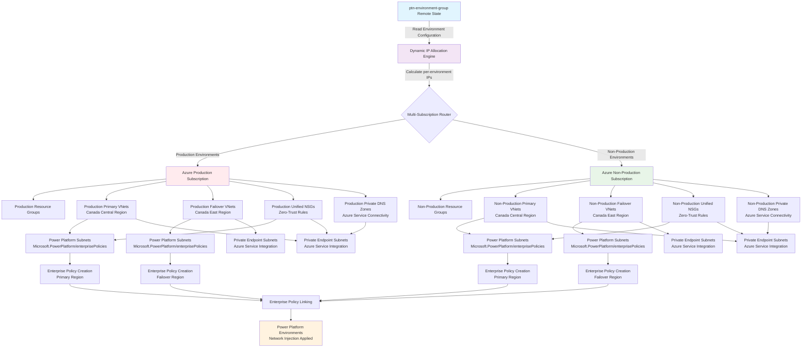
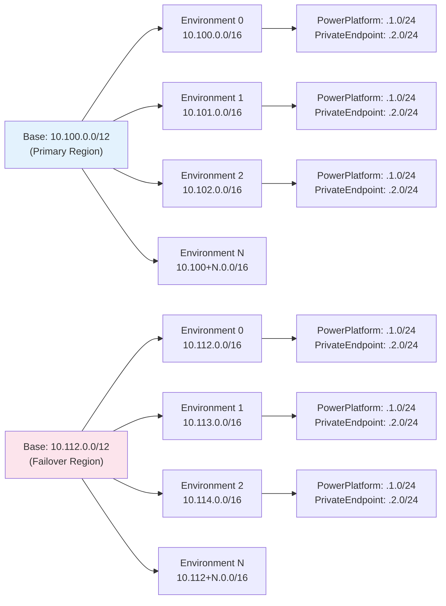

# Power Platform Azure VNet Extension Pattern

This configuration orchestrates Azure Virtual Network infrastructure with Power Platform enterprise policies for network injection capabilities, featuring **dynamic per-environment scaling**, **zero-trust networking**, and **private DNS zones** following Azure Verified Module (AVM) best practices with Power Platform provider adaptations.

## Architecture Overview



### Dynamic IP Allocation Flow



## Key Features

- **🔄 Dynamic Per-Environment IP Allocation**: Automatic IP range calculation supporting 2-16 environments with zero conflicts
- **🌐 Dual VNet Architecture**: Primary and failover regions with mathematically calculated non-overlapping IP ranges
- **📈 Enterprise Scaling**: Base address spaces (`/12`) automatically subdivided into per-environment VNets (`/16`)
- **🏢 Enterprise Policy Integration**: Automatic Power Platform network injection policy deployment
- **🔒 Multi-Subscription Support**: Production and non-production environment segregation
- **�️ Zero-Trust Networking**: Unified NSG architecture with 5 focused security rules per environment
- **🔐 Private DNS Zones**: On-demand Azure service connectivity with automatic VNet linking
- **�🔗 Remote State Integration**: Reads from ptn-environment-group for seamless pattern composition
- **📋 CAF Naming Compliance**: Cloud Adoption Framework naming conventions with consistent lowercase conversion
- **🎯 Unified NSG Architecture**: Single NSG per environment serving both PowerPlatform and PrivateEndpoint subnets

## Dynamic IP Allocation Architecture

### Base Address Space Approach
Instead of hardcoded IP ranges, this pattern uses **base address spaces** that automatically calculate unique IP ranges for each environment:

```hcl
# Base address spaces provide capacity for multiple environments
network_configuration = {
  primary = {
    vnet_address_space_base = "10.100.0.0/12"  # 1,048,576 IPs → 16 environments
  }
  failover = {
    vnet_address_space_base = "10.112.0.0/12"  # 1,048,576 IPs → 16 environments
  }
}
```

### Per-Environment Allocation Examples

**2 Environments (Non-Prod + Prod):**
- Environment 0: Primary `10.100.0.0/16`, Failover `10.112.0.0/16` (65,536 IPs each)
- Environment 1: Primary `10.101.0.0/16`, Failover `10.113.0.0/16` (65,536 IPs each)

**3 Environments (Dev + Test + Prod):**
- Environment 0 (dev): Primary `10.100.0.0/16`, Failover `10.112.0.0/16`
- Environment 1 (test): Primary `10.101.0.0/16`, Failover `10.113.0.0/16`
- Environment 2 (prod): Primary `10.102.0.0/16`, Failover `10.114.0.0/16`

**4 Environments (Dev + Test + UAT + Prod):**
- Environment 3 (uat): Primary `10.103.0.0/16`, Failover `10.115.0.0/16`

### Subnet Layout per Environment
Each environment gets consistent subnet allocation within its `/16`:
- **Power Platform Subnet**: `.1.0/24` (256 IPs for Power Platform delegation)
- **Private Endpoint Subnet**: `.2.0/24` (256 IPs for Azure service connectivity)

## Regional Configuration Best Practices

### Supported Regional Deployments

The following regional configurations are supported and aligned with Power Platform boundaries:

#### **Canada Central + Canada East**
```hcl
# tfvars/regional-examples.tfvars
network_configuration = {
  primary = {
    location                = "Canada Central"       # Power Platform region: "canada"
    vnet_address_space_base = "10.100.0.0/12"      # Supports 16 environments
  }
  failover = {
    location                = "Canada East"          # Power Platform region: "canada"
    vnet_address_space_base = "10.116.0.0/12"      # Non-overlapping with primary
  }
}
```

#### **East US + West US 2**
```hcl
# Alternative configuration
network_configuration = {
  primary = {
    location                = "East US"              # Power Platform region: "unitedstates"
    vnet_address_space_base = "10.96.0.0/12"       # Supports 16 environments
  }
  failover = {
    location                = "West US 2"           # Power Platform region: "unitedstates"  
    vnet_address_space_base = "10.112.0.0/12"      # Non-overlapping with primary
  }
}
```

### Power Platform Regional Alignment

**CRITICAL**: Azure regions must align with Power Platform regions for successful enterprise policy linking:

| **Azure Region** | **Power Platform Region** | **Deployment Status** |
| ---------------- | ------------------------- | --------------------- |
| Canada Central   | canada                    | ✅ **Supported**       |
| Canada East      | canada                    | ✅ **Supported**       |
| East US          | unitedstates              | ✅ **Supported**       |
| West US 2        | unitedstates              | ✅ **Supported**       |

### IP Range Planning Guidelines

#### **Base Address Space Selection**

Choose base address spaces that provide sufficient capacity and avoid conflicts:

```hcl
# ✅ RECOMMENDED: Non-overlapping /12 ranges
primary_base   = "10.100.0.0/12"  # 10.100.0.0 - 10.115.255.255
failover_base  = "10.116.0.0/12"  # 10.116.0.0 - 10.131.255.255

# ✅ ALTERNATIVE: Different /12 blocks
primary_base   = "10.96.0.0/12"   # 10.96.0.0 - 10.111.255.255
failover_base  = "10.112.0.0/12"  # 10.112.0.0 - 10.127.255.255

# ❌ AVOID: Overlapping ranges
primary_base   = "10.100.0.0/12"  # 10.100.0.0 - 10.115.255.255
failover_base  = "10.110.0.0/12"  # 10.110.0.0 - 10.125.255.255 (OVERLAP!)
```

#### **Environment Capacity Planning**

| **Environment Count** | **Required Base** | **Per-Environment IPs** |
| --------------------- | ----------------- | ----------------------- |
| 2 environments        | `/13` or larger   | 65,536 each             |
| 4 environments        | `/12` or larger   | 65,536 each             |
| 8 environments        | `/11` or larger   | 65,536 each             |
| 16 environments       | `/10` or larger   | 65,536 each             |

### Multi-Subscription Architecture Patterns

#### **Production Isolation Pattern (Recommended)**
```hcl
# Separate subscriptions for production vs non-production workloads
production_subscription_id     = "12345678-prod-1234-1234-123456789012"
non_production_subscription_id = "87654321-nprd-4321-4321-210987654321"
```

**Benefits:**
- **Security Isolation**: Production workloads isolated from development/testing
- **Cost Management**: Clear separation for billing and cost allocation
- **Compliance**: Meets regulatory requirements for production environment separation
- **Access Control**: Different RBAC policies for production vs non-production resources

#### **Regional Failover Considerations**

**Network Latency Requirements:**
- Primary ↔ Failover regions should have <100ms latency for optimal Power Platform performance
- Use Azure region pairs when possible for guaranteed data residency compliance
- Consider Power Platform region boundaries when selecting Azure regions

**Disaster Recovery Planning:**
- Primary region handles normal operations
- Failover region provides disaster recovery capabilities
- Enterprise policies apply to both regions automatically
- Test failover procedures regularly to ensure functionality

## Use Cases

This configuration is designed for organizations that need to:

1. **🎯 Multi-Environment Network Injection**: Deploy consistent Power Platform network policies across dev, test, and production environments
2. **🔄 Dynamic Environment Scaling**: Support flexible environment counts (2-16) without manual IP planning
3. **🌍 Multi-Region Resilience**: Establish primary and failover VNets in adjacent Azure regions for business continuity
4. **🏢 Production Environment Isolation**: Separate production workloads into dedicated subscriptions with strict network controls
5. **�️ Zero-Trust Security Implementation**: Deploy unified NSG architecture with focused security rules eliminating external dependencies
6. **🔐 Private Azure Service Connectivity**: Enable secure communication with Azure Key Vault, Storage, Cosmos DB, and SQL Database through private DNS zones
7. **📊 Governance at Scale**: Apply consistent network policies and security rules across multiple Power Platform environments automatically
8. **🎯 Simplified Security Management**: Maintain identical security posture across PowerPlatform and PrivateEndpoint subnets with unified NSGs
9. **⚡ VNet Injection Optimization**: Eliminate unnecessary external inbound traffic through true network injection principles

## Pattern Architecture

This pattern module orchestrates multiple Azure Verified Module (AVM) modules following AVM principles:

- **Azure/avm-res-resources-resourcegroup**: Single resource group per environment architecture
- **Azure/avm-res-network-virtualnetwork**: Primary and failover VNets with Power Platform delegation and private endpoint subnets
- **Azure/avm-res-network-networksecuritygroup**: Unified NSGs with 5 focused zero-trust security rules per environment
- **Azure/avm-res-network-privatednszone**: On-demand private DNS zones with VNet linking for Azure service connectivity
- **res-enterprise-policy**: Power Platform network injection policy creation
- **res-enterprise-policy-link**: Enterprise policy linking to Power Platform environments

## Scaling Capabilities

| **Environment Count** | **Total IP Capacity** | **Per-Environment IPs** | **Status**             |
| --------------------- | --------------------- | ----------------------- | ---------------------- |
| 2 environments        | 262,144 IPs           | 131,072 IPs each        | ✅ **Supported**        |
| 3 environments        | 393,216 IPs           | 131,072 IPs each        | ✅ **Supported**        |
| 4 environments        | 524,288 IPs           | 131,072 IPs each        | ✅ **Supported**        |
| Up to 16 environments | 2,097,152 IPs         | 131,072 IPs each        | ✅ **Enterprise Scale** |

## Environment-Specific Configuration Patterns

### Production Environments
- Dedicated Azure subscription with enhanced security controls
- Automatic IP allocation within production IP ranges
- Stricter network access controls and monitoring
- Dedicated `/16` with 65,536 IPs capacity

### Non-Production Environments
- Shared Azure subscription for cost optimization  
- Automatic IP allocation within non-production IP ranges
- Relaxed network controls for development efficiency
- Each environment gets dedicated `/16` with 65,536 IPs capacity

## Usage with GitHub Actions

```yaml
# GitHub Actions workflow input
inputs:
  configuration: 'ptn-azure-vnet-extension'
  tfvars_file: 'tfvars/regional-examples.tfvars'
  # Environment count is determined automatically from ptn-environment-group
```

## Advanced Pattern Composition

This pattern is designed to extend ptn-environment-group configurations and automatically scales to match the environment count:

```hcl
# Deploy environment group first (defines environment count)
module "environment_group" {
  source = "../ptn-environment-group"
  workspace_name = "ProductionWorkspace"
  environments = ["dev", "test", "prod"]  # 3 environments
}

# VNet extension automatically creates 3 sets of VNets with unique IP ranges
module "vnet_extension" {
  source = "../ptn-azure-vnet-extension"
  workspace_name = "ProductionWorkspace"  # Must match
  
  network_configuration = {
    primary = {
      vnet_address_space_base = "10.100.0.0/12"  # Auto-scales to 3 environments
    }
    failover = {
      vnet_address_space_base = "10.112.0.0/12"  # Auto-scales to 3 environments
    }
    # ... subnet allocation config
  }
  
  depends_on = [module.environment_group]
}
```
