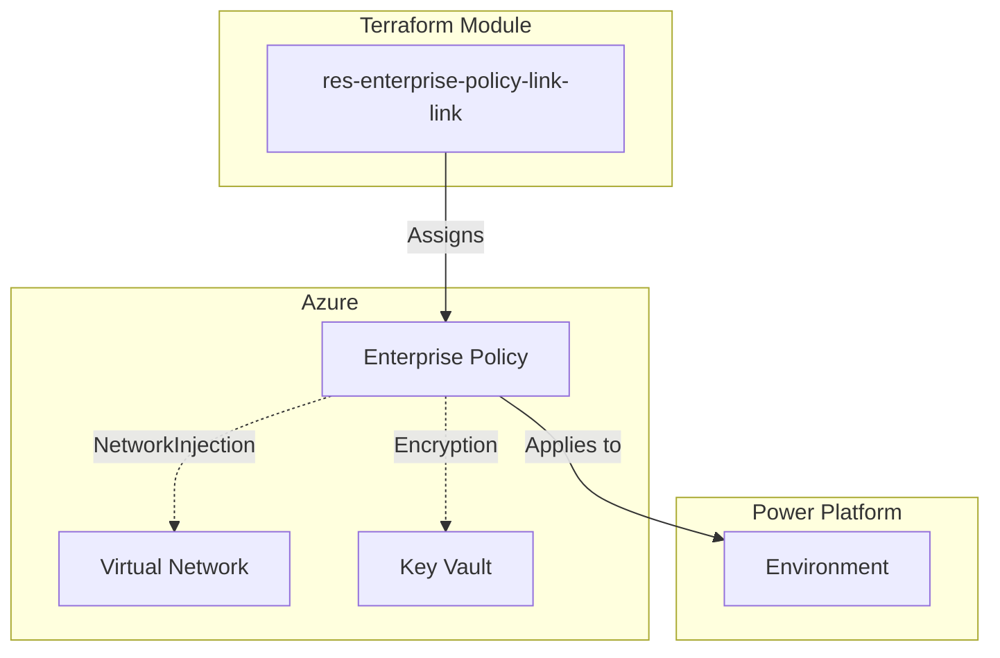

<!-- BEGIN_TF_DOCS -->
# Power Platform Enterprise Policy Resource Module

[](https://www.terraform.io/)
[](https://powerplatform.microsoft.com/)

> **PPCC25 Demo Module** - Part of "Enhancing Power Platform Governance Through Terraform: Embracing Infrastructure as Code" session

This Terraform module creates and manages **Power Platform Enterprise Policy assignments** following Azure Verified Module (AVM) best practices. It enables Infrastructure as Code governance for VNet integration and encryption policies in Power Platform environments.

## 🎯 Key Features

- **🔐 VNet Integration**: Assign NetworkInjection policies for private connectivity
- **🔒 Data Encryption**: Apply customer-managed key encryption policies  
- **🛡️ Security-First**: OIDC authentication, no hardcoded secrets
- **📋 AVM Compliant**: Follows Azure Verified Module specifications
- **🧪 Fully Tested**: Comprehensive test coverage with 20+ assertions
- **📖 Educational**: Clear examples for learning Infrastructure as Code

## 🚀 Quick Start

### NetworkInjection Policy Example

```hcl
module "vnet_policy" {
  source = "../res-enterprise-policy-link"
  environment_id = "12345678-1234-5678-9abc-123456789012"
  policy_type    = "NetworkInjection"
  system_id      = "/regions/unitedstates/providers/Microsoft.PowerPlatform/enterprisePolicies/vnet-policy-id"
}
```

### Encryption Policy Example

```hcl
module "encryption_policy" {
  source = "../res-enterprise-policy-link"
  environment_id = "12345678-1234-5678-9abc-123456789012"
  policy_type    = "Encryption"
  system_id      = "/regions/unitedstates/providers/Microsoft.PowerPlatform/enterprisePolicies/encryption-policy-id"
  # Optional: Customize timeouts for large environments
  timeouts = {
    create = "15m"
    delete = "15m"
  }
}
```

## 🏗️ Architecture



## 📋 Prerequisites

### Azure Requirements
- Azure enterprise policy resource (pre-created)
- Appropriate Azure RBAC permissions
- For NetworkInjection: VNet with subnet delegation
- For Encryption: Azure Key Vault with proper configuration

### Power Platform Requirements
- Target Power Platform environment (existing)
- Power Platform admin or environment admin permissions
- For Encryption: Managed environment configuration

### Authentication
- OIDC authentication configured for both Azure and Power Platform
- Service principal with enterprise policy assignment permissions

## 🔧 Policy Types

| Policy Type | Purpose | Prerequisites | Use Cases |
|-------------|---------|---------------|----------|
| `NetworkInjection` | VNet integration | VNet, subnet delegation | Private connectivity, hybrid scenarios |
| `Encryption` | CMK encryption | Key Vault, managed env | Data protection, compliance |

## 📊 Governance Benefits

- **Consistency**: Standardized policy assignment across environments
- **Auditability**: Full Infrastructure as Code audit trail
- **Version Control**: Policy changes tracked in Git
- **Automation**: Integrate with CI/CD pipelines
- **Compliance**: Meet enterprise governance requirements

## Usage

Basic usage:

```hcl
module "enterprise_policy" {
  source = "../res-enterprise-policy-link"
  
  environment_id = "12345678-1234-5678-9abc-123456789012"
  policy_type    = "NetworkInjection"
  system_id      = "/regions/unitedstates/providers/Microsoft.PowerPlatform/enterprisePolicies/abcdef12-3456-789a-bcde-f123456789ab"
}
```

## Requirements

| Name | Version |
|------|---------|
| <a name="requirement_terraform"></a> [terraform](#requirement\_terraform) | >= 1.5.0 |
| <a name="requirement_powerplatform"></a> [powerplatform](#requirement\_powerplatform) | ~> 3.8 |

## Providers

| Name | Version |
|------|---------|
| <a name="provider_powerplatform"></a> [powerplatform](#provider\_powerplatform) | ~> 3.8 |

## Resources

| Name | Type |
|------|------|
| [powerplatform_enterprise_policy.this](https://registry.terraform.io/providers/microsoft/power-platform/latest/docs/resources/enterprise_policy) | resource |

## Inputs

| Name | Description | Type | Default | Required |
|------|-------------|------|---------|:--------:|
| <a name="input_environment_id"></a> [environment\_id](#input\_environment\_id) | Target Power Platform environment ID for enterprise policy assignment.<br/><br/>This variable specifies which Power Platform environment will have the enterprise<br/>policy applied. The environment must exist and be accessible for policy assignment.<br/><br/>Usage Context:<br/>- Used to bind enterprise policies to specific Power Platform environments<br/>- Must be a valid GUID representing an existing Power Platform environment<br/>- Environment must support the specified policy type (NetworkInjection/Encryption)<br/><br/>Validation Rules:<br/>- Must be a valid GUID format (8-4-4-4-12 hexadecimal pattern)<br/>- Environment must be accessible with current authentication<br/>- For NetworkInjection: Environment should have Dataverse enabled<br/>- For Encryption: Environment must be configured as managed environment<br/><br/>Example Values:<br/>- "12345678-1234-5678-9abc-123456789012" (development environment)<br/>- "abcdef12-3456-789a-bcde-f123456789ab" (production environment)<br/><br/>Security Considerations:<br/>- Environment IDs are not sensitive but should be validated for existence<br/>- Ensure proper RBAC permissions for policy assignment to the target environment | `string` | n/a | yes |
| <a name="input_policy_type"></a> [policy\_type](#input\_policy\_type) | Type of enterprise policy to assign to the environment.<br/><br/>This variable determines which type of enterprise policy will be applied to the<br/>target environment. Different policy types provide different governance capabilities.<br/><br/>Supported Policy Types:<br/>- NetworkInjection: Enables VNet integration and subnet delegation for the environment<br/>- Encryption: Applies customer-managed key encryption using Azure Key Vault<br/><br/>Usage Context:<br/>- NetworkInjection: Used for environments requiring private connectivity to Azure resources<br/>- Encryption: Used for environments requiring enhanced data protection with CMK<br/>- Policy type must match the capabilities of the target Azure policy resource<br/><br/>Prerequisites by Policy Type:<br/>- NetworkInjection: Requires Azure VNet, subnet with delegation, and proper networking setup<br/>- Encryption: Requires Azure Key Vault, managed environment configuration, and proper permissions<br/><br/>Example Values:<br/>- "NetworkInjection" (for VNet integration scenarios)<br/>- "Encryption" (for customer-managed key scenarios)<br/><br/>Validation Rules:<br/>- Must be exactly "NetworkInjection" or "Encryption" (case-sensitive)<br/>- Policy type must be supported by the Power Platform provider version | `string` | n/a | yes |
| <a name="input_system_id"></a> [system\_id](#input\_system\_id) | Enterprise policy system ID in Azure Resource Manager format.<br/><br/>This variable specifies the Azure resource identifier for the enterprise policy<br/>that will be assigned to the target environment. The system ID must reference<br/>an existing Azure enterprise policy resource.<br/><br/>Format Requirements:<br/>- Must follow ARM resource ID pattern<br/>- Format: /regions/<location>/providers/Microsoft.PowerPlatform/enterprisePolicies/<policy-id><br/>- Location must match the Power Platform environment's Azure region<br/>- Policy ID must be a valid GUID representing an existing enterprise policy<br/><br/>Usage Context:<br/>- Links Power Platform environment to Azure-based enterprise policy<br/>- Enables governance control through Azure Policy and Azure Resource Manager<br/>- Policy must be pre-created in Azure before assignment<br/><br/>Example Values:<br/>- "/regions/unitedstates/providers/Microsoft.PowerPlatform/enterprisePolicies/12345678-1234-5678-9abc-123456789012"<br/>- "/regions/europe/providers/Microsoft.PowerPlatform/enterprisePolicies/abcdef12-3456-789a-bcde-f123456789ab"<br/><br/>Validation Rules:<br/>- Must match the exact ARM resource ID format<br/>- Region must be valid Power Platform region identifier<br/>- Policy ID must be a valid GUID format<br/>- Referenced policy resource must exist in Azure<br/><br/>Security Considerations:<br/>- System IDs are not sensitive but should reference valid, authorized policies<br/>- Ensure proper Azure RBAC permissions for policy resource access | `string` | n/a | yes |
| <a name="input_validate_environment"></a> [validate\_environment](#input\_validate\_environment) | Whether to enable environment validation for policy assignment.<br/><br/>This variable is kept for API compatibility but validation is handled<br/>through the Power Platform provider's built-in error handling.<br/><br/>Default Value: true (maintained for consistency) | `bool` | `true` | no |

## Outputs

| Name | Description |
|------|-------------|
| <a name="output_deployment_summary"></a> [deployment\_summary](#output\_deployment\_summary) | Comprehensive summary of the enterprise policy deployment for validation and compliance.<br/><br/>This output aggregates all key deployment information into a single object<br/>suitable for reporting, validation, and integration with external systems.<br/>Follows AVM patterns for configuration summary outputs.<br/><br/>Summary Components:<br/>- Resource Information: IDs, types, and identifiers<br/>- Configuration Details: Policy type, validation settings, lifecycle options<br/>- Deployment Metadata: Timestamps, module version, and operational details<br/>- Validation Status: Environment validation and prerequisite checks<br/><br/>Usage Examples:<br/>- Automated compliance reporting and audit trails<br/>- Integration with governance dashboards and monitoring<br/>- Validation in CI/CD pipelines and deployment verification<br/>- Documentation generation and deployment artifacts<br/><br/>Data Quality:<br/>- All timestamps are in RFC3339 format for consistency<br/>- Version information tracks module evolution<br/>- Status fields provide clear deployment state indication<br/><br/>Security: Contains no sensitive information, designed for external consumption |
| <a name="output_enterprise_policy_id"></a> [enterprise\_policy\_id](#output\_enterprise\_policy\_id) | The unique identifier of the enterprise policy assignment.<br/><br/>This output provides the primary key for referencing this policy assignment<br/>in other Terraform configurations or external systems. The ID represents the<br/>specific binding between the Power Platform environment and the Azure enterprise policy.<br/><br/>Usage Examples:<br/>- Reference in other modules: module.enterprise\_policy.enterprise\_policy\_id<br/>- Export for external systems integration<br/>- Use in dependency chains for resource ordering<br/>- Include in governance reporting and audit trails<br/><br/>Format: Typically a GUID assigned by the Power Platform service<br/>Example: "12345678-1234-5678-9abc-123456789012"<br/><br/>Security Note: This ID is not sensitive and can be safely logged or exported. |
| <a name="output_environment_assignments"></a> [environment\_assignments](#output\_environment\_assignments) | Summary of policy assignments to environments for governance tracking.<br/><br/>This output provides a consolidated view of the environment-policy relationship<br/>established by this module. Designed for governance reporting, audit trails,<br/>and integration with policy management systems.<br/><br/>Included Information:<br/>- environment\_id: Target Power Platform environment<br/>- assignment\_id: Unique identifier for this policy assignment<br/>- policy\_type: Type of enterprise policy applied<br/>- system\_id: Azure enterprise policy resource reference<br/>- assignment\_status: Status of the policy assignment (if available)<br/><br/>Usage Examples:<br/>- Governance dashboards showing policy coverage<br/>- Audit reports for compliance verification<br/>- Integration with enterprise policy management systems<br/>- Automated policy assignment validation<br/><br/>Data Structure: Object with comprehensive assignment metadata<br/>Update Frequency: Changes when policy assignments are modified<br/>Security: Contains no sensitive data, safe for external reporting |
| <a name="output_module_metadata"></a> [module\_metadata](#output\_module\_metadata) | Metadata about the res-enterprise-policy-link module deployment.<br/><br/>This output provides operational information about the module itself,<br/>including version, capabilities, and configuration options. Useful for<br/>module management, troubleshooting, and integration validation.<br/><br/>Metadata Components:<br/>- module\_type: Always "res-enterprise-policy-link" for identification<br/>- module\_version: Semantic version of this module implementation<br/>- supported\_policy\_types: List of enterprise policy types supported<br/>- avm\_compliance: AVM specification compliance information<br/>- provider\_requirements: Power Platform provider version requirements<br/><br/>Usage Examples:<br/>- Module inventory and version management<br/>- Compatibility checking in parent modules<br/>- Documentation generation and module catalogs<br/>- Troubleshooting and support ticket information<br/><br/>Data Stability: Module metadata changes only with module updates<br/>Format: Structured object with consistent field names across AVM modules<br/>Security: Contains no sensitive operational information |
| <a name="output_policy_assignment_details"></a> [policy\_assignment\_details](#output\_policy\_assignment\_details) | Comprehensive details of the enterprise policy assignment configuration.<br/><br/>This output provides a structured summary of the policy assignment including<br/>all key configuration parameters. Useful for validation, reporting, and<br/>downstream module consumption.<br/><br/>Included Information:<br/>- environment\_id: Target Power Platform environment identifier<br/>- policy\_type: Type of enterprise policy (NetworkInjection/Encryption)<br/>- system\_id: Azure enterprise policy resource identifier<br/>- assignment\_id: Power Platform policy assignment identifier<br/><br/>Usage Examples:<br/>- Validation: Confirm policy was assigned correctly<br/>- Reporting: Include in governance dashboards<br/>- Integration: Pass to monitoring or audit systems<br/>- Documentation: Auto-generate deployment reports<br/><br/>Data Structure: Object with string properties<br/>Security: Contains no sensitive information, safe for logging |
| <a name="output_policy_type"></a> [policy\_type](#output\_policy\_type) | The type of enterprise policy assigned to the environment.<br/><br/>This discrete output provides the policy type for downstream consumption<br/>without exposing the full resource object. Useful for conditional logic<br/>in parent modules and policy type validation.<br/><br/>Valid Values:<br/>- "NetworkInjection" - VNet integration and subnet delegation policy<br/>- "Encryption" - Customer-managed key encryption policy<br/><br/>Usage Examples:<br/>- Conditional resource creation based on policy type<br/>- Validation in parent modules or patterns<br/>- Documentation generation and reporting<br/>- Integration with monitoring systems<br/><br/>Format: String value matching the input policy\_type variable<br/>Security: Policy type is not sensitive information |
| <a name="output_target_environment_id"></a> [target\_environment\_id](#output\_target\_environment\_id) | The Power Platform environment ID that received the policy assignment.<br/><br/>This discrete output provides the target environment identifier for<br/>downstream consumption and validation. Useful for chaining modules<br/>and creating dependency relationships.<br/><br/>Usage Examples:<br/>- Reference in dependent modules requiring the same environment<br/>- Validation that policy was applied to correct environment<br/>- Documentation and audit trail generation<br/>- Integration with environment management systems<br/><br/>Format: GUID string representing the Power Platform environment<br/>Example: "12345678-1234-5678-9abc-123456789012"<br/>Source: Directly from the powerplatform\_enterprise\_policy resource |

## 🔍 Examples

See the [`tfvars/`](./tfvars/) directory for complete configuration examples:

- [`network-injection-example.tfvars`](./tfvars/network-injection-example.tfvars) - VNet integration policy assignment
- [`encryption-example.tfvars`](./tfvars/encryption-example.tfvars) - Customer-managed key encryption policy

## 🧪 Testing

This module includes comprehensive integration tests:

```bash
# Run all tests
terraform test

# Run format validation
terraform fmt -check -recursive

# Run syntax validation
terraform validate
```

## 🚨 Common Issues

### Policy Assignment Fails

**Symptoms**: Policy assignment returns permission errors or invalid environment

**Solutions**:
1. Verify environment exists and is accessible
2. Check Azure RBAC permissions for enterprise policy assignment
3. For NetworkInjection: Ensure VNet and subnet are properly configured
4. For Encryption: Verify managed environment configuration

### Timeout Errors

**Symptoms**: Operations timeout during create/update/delete

**Solutions**:
1. Increase timeout values in the `timeouts` variable
2. Check Azure and Power Platform service health
3. Verify network connectivity and authentication

### System ID Format Errors

**Symptoms**: Invalid system\_id format validation errors

**Solutions**:
1. Verify system\_id follows exact ARM format
2. Check region matches environment's Azure region
3. Confirm enterprise policy exists in Azure

## 📚 Learn More

### Microsoft Documentation
- [Power Platform Enterprise Policies](https://docs.microsoft.com/power-platform/admin/managed-environment-overview)
- [VNet Integration for Power Platform](https://docs.microsoft.com/power-platform/admin/managed-environment-sharing-limits)
- [Customer-Managed Keys](https://docs.microsoft.com/power-platform/admin/customer-managed-key)

### PPCC25 Resources
- [Session Materials](../../docs/)
- [Demo Scripts](../../scripts/)
- [Configuration Examples](../)

### Terraform Resources
- [Power Platform Provider](https://registry.terraform.io/providers/microsoft/power-platform/latest)
- [Azure Verified Modules](https://azure.github.io/Azure-Verified-Modules/)
- [Terraform Best Practices](https://www.terraform.io/docs/cloud/guides/recommended-practices/index.html)

## 🤝 Contributing

This module is part of the PPCC25 demonstration repository. For improvements or issues:

1. Check existing [issues](../../../../issues) and [pull requests](../../../../pulls)
2. Follow the [contribution guidelines](../../../../CONTRIBUTING.md)
3. Test changes using the included test suite
4. Update documentation for any new features

## 📄 License

This project is licensed under the MIT License - see the [LICENSE](../../../../LICENSE) file for details.

---

**⚡ Power Platform + Terraform = Governance at Scale**

*Part of the PPCC25 "Enhancing Power Platform Governance Through Terraform" demo series*
<!-- END_TF_DOCS -->