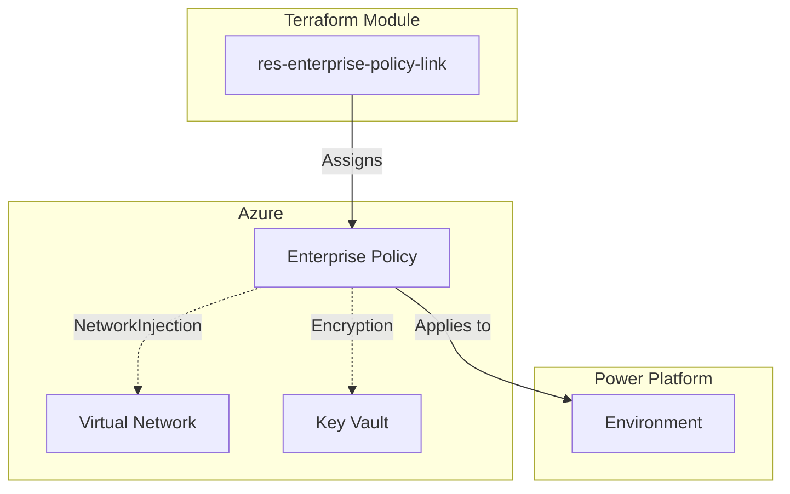

<!-- BEGIN_TF_DOCS -->
# Power Platform Enterprise Policy Resource Module

[](https://www.terraform.io/)
[](https://powerplatform.microsoft.com/)

> **PPCC25 Demo Module** - Part of "Enhancing Power Platform Governance Through Terraform: Embracing Infrastructure as Code" session

This Terraform module creates and manages **Power Platform Enterprise Policy assignments** following Azure Verified Module (AVM) best practices. It enables Infrastructure as Code governance for VNet integration and encryption policies in Power Platform environments.

## 🎯 Key Features

- **🔐 VNet Integration**: Assign NetworkInjection policies for private connectivity
- **🔒 Data Encryption**: Apply customer-managed key encryption policies  
- **🛡️ Security-First**: OIDC authentication, no hardcoded secrets
- **📋 AVM Compliant**: Follows Azure Verified Module specifications
- **🧪 Fully Tested**: Comprehensive test coverage with 20+ assertions
- **📖 Educational**: Clear examples for learning Infrastructure as Code

## 🚀 Quick Start

### NetworkInjection Policy Example

```hcl
module "vnet_policy" {
  source = "../res-enterprise-policy-link"
  environment_id = "36f603f9-0af2-e33d-98a5-64b02c1bac19"
  policy_type    = "NetworkInjection"
  system_id      = "/regions/unitedstates/providers/Microsoft.PowerPlatform/enterprisePolicies/vnet-policy-id"
}
```

### Encryption Policy Example

```hcl
module "encryption_policy" {
  source = "../res-enterprise-policy-link"
  environment_id = "36f603f9-0af2-e33d-98a5-64b02c1bac19"
  policy_type    = "Encryption"
  system_id      = "/regions/unitedstates/providers/Microsoft.PowerPlatform/enterprisePolicies/encryption-policy-id"
  # Optional: Customize timeouts for large environments
  timeouts = {
    create = "15m"
    delete = "15m"
  }
}
```

## 🏗️ Architecture



## 📋 Prerequisites

### Azure Requirements
- Azure enterprise policy resource (pre-created)
- Appropriate Azure RBAC permissions
- For NetworkInjection: VNet with subnet delegation
- For Encryption: Azure Key Vault with proper configuration

### Power Platform Requirements
- Target Power Platform environment (existing)
- Power Platform admin or environment admin permissions
- For Encryption: Managed environment configuration

### Authentication
- OIDC authentication configured for both Azure and Power Platform
- Service principal with enterprise policy assignment permissions

## 🔧 Policy Types

| Policy Type | Purpose | Prerequisites | Use Cases |
|-------------|---------|---------------|----------|
| `NetworkInjection` | VNet integration | VNet, subnet delegation | Private connectivity, hybrid scenarios |
| `Encryption` | CMK encryption | Key Vault, managed env | Data protection, compliance |

## 📊 Governance Benefits

- **Consistency**: Standardized policy assignment across environments
- **Auditability**: Full Infrastructure as Code audit trail
- **Version Control**: Policy changes tracked in Git
- **Automation**: Integrate with CI/CD pipelines
- **Compliance**: Meet enterprise governance requirements

<!-- markdownlint-disable MD033 -->
## Requirements

The following requirements are needed by this module:

- <a name="requirement_terraform"></a> [terraform](#requirement\_terraform) (>= 1.5.0)

- <a name="requirement_powerplatform"></a> [powerplatform](#requirement\_powerplatform) (~> 3.8)

## Providers

The following providers are used by this module:

- <a name="provider_powerplatform"></a> [powerplatform](#provider\_powerplatform) (~> 3.8)

## Resources

The following resources are used by this module:

- [powerplatform_enterprise_policy.this](https://registry.terraform.io/providers/microsoft/power-platform/latest/docs/resources/enterprise_policy) (resource)

<!-- markdownlint-disable MD013 -->
## Required Inputs

The following input variables are required:

### <a name="input_environment_id"></a> [environment\_id](#input\_environment\_id)

Description: Target Power Platform environment ID for enterprise policy assignment.

This variable specifies which Power Platform environment will have the enterprise  
policy applied. The environment must exist and be accessible for policy assignment.

Usage Context:
- Used to bind enterprise policies to specific Power Platform environments
- Must be a valid GUID representing an existing Power Platform environment
- Environment must support the specified policy type (NetworkInjection/Encryption)

Validation Rules:
- Must be a valid GUID format (8-4-4-4-12 hexadecimal pattern)
- Environment must be accessible with current authentication
- For NetworkInjection: Environment should have Dataverse enabled
- For Encryption: Environment must be configured as managed environment

Example Values:
- "36f603f9-0af2-e33d-98a5-64b02c1bac19" (development environment)
- "abcdef12-3456-789a-bcde-f123456789ab" (production environment)

Security Considerations:
- Environment IDs are not sensitive but should be validated for existence
- Ensure proper RBAC permissions for policy assignment to the target environment

Type: `string`

### <a name="input_policy_type"></a> [policy\_type](#input\_policy\_type)

Description: Type of enterprise policy to assign to the environment.

This variable determines which type of enterprise policy will be applied to the  
target environment. Different policy types provide different governance capabilities.

Supported Policy Types:
- NetworkInjection: Enables VNet integration and subnet delegation for the environment
- Encryption: Applies customer-managed key encryption using Azure Key Vault

Usage Context:
- NetworkInjection: Used for environments requiring private connectivity to Azure resources
- Encryption: Used for environments requiring enhanced data protection with CMK
- Policy type must match the capabilities of the target Azure policy resource

Prerequisites by Policy Type:
- NetworkInjection: Requires Azure VNet, subnet with delegation, and proper networking setup
- Encryption: Requires Azure Key Vault, managed environment configuration, and proper permissions

Example Values:
- "NetworkInjection" (for VNet integration scenarios)
- "Encryption" (for customer-managed key scenarios)

Validation Rules:
- Must be exactly "NetworkInjection" or "Encryption" (case-sensitive)
- Policy type must be supported by the Power Platform provider version

Type: `string`

### <a name="input_system_id"></a> [system\_id](#input\_system\_id)

Description: Enterprise policy system ID in Azure Resource Manager format.

This variable specifies the Azure resource identifier for the enterprise policy  
that will be assigned to the target environment. The system ID must reference  
an existing Azure enterprise policy resource.

Format Requirements:
- Must follow ARM resource ID pattern
- Format: /regions/<location>/providers/Microsoft.PowerPlatform/enterprisePolicies/<policy-id>
- Location must match the Power Platform environment's Azure region
- Policy ID must be a valid GUID representing an existing enterprise policy

Usage Context:
- Links Power Platform environment to Azure-based enterprise policy
- Enables governance control through Azure Policy and Azure Resource Manager
- Policy must be pre-created in Azure before assignment

Example Values:
- "/regions/unitedstates/providers/Microsoft.PowerPlatform/enterprisePolicies/36f603f9-0af2-e33d-98a5-64b02c1bac19"
- "/regions/europe/providers/Microsoft.PowerPlatform/enterprisePolicies/abcdef12-3456-789a-bcde-f123456789ab"

Validation Rules:
- Must match the exact ARM resource ID format
- Region must be valid Power Platform region identifier
- Policy ID must be a valid GUID format
- Referenced policy resource must exist in Azure

Security Considerations:
- System IDs are not sensitive but should reference valid, authorized policies
- Ensure proper Azure RBAC permissions for policy resource access

Type: `string`

## Optional Inputs

No optional inputs.

## Outputs

The following outputs are exported:

### <a name="output_deployment_summary"></a> [deployment\_summary](#output\_deployment\_summary)

Description: Comprehensive summary of the enterprise policy assignment deployment for validation and compliance.

This output aggregates all key deployment information into a single object  
suitable for reporting, validation, and integration with external systems.  
Follows AVM patterns for configuration summary outputs.

IMPORTANT: This module assigns existing Azure enterprise policies to Power Platform environments.  
The Azure enterprise policy must be pre-created (typically using azapi\_resource).

Summary Components:
- Resource Information: IDs, types, and identifiers
- Configuration Details: Policy type and assignment parameters
- Deployment Metadata: Timestamps, module version, and operational details
- Assignment Status: Policy assignment completion and validation

Usage Examples:
- Automated compliance reporting and audit trails
- Integration with governance dashboards and monitoring
- Validation in CI/CD pipelines and deployment verification
- Documentation generation and deployment artifacts

Data Quality:
- All timestamps are in RFC3339 format for consistency
- Version information tracks module evolution
- Status fields provide clear deployment state indication

Security: Contains no sensitive information, designed for external consumption

### <a name="output_enterprise_policy_id"></a> [enterprise\_policy\_id](#output\_enterprise\_policy\_id)

Description: The unique identifier of the enterprise policy assignment.

This output provides the primary key for referencing this policy assignment  
in other Terraform configurations or external systems. The ID represents the  
specific binding between the Power Platform environment and the Azure enterprise policy.

Usage Examples:
- Reference in other modules: module.enterprise\_policy.enterprise\_policy\_id
- Export for external systems integration
- Use in dependency chains for resource ordering
- Include in governance reporting and audit trails

Format: Typically a GUID assigned by the Power Platform service  
Example: "36f603f9-0af2-e33d-98a5-64b02c1bac19"

Security Note: This ID is not sensitive and can be safely logged or exported.

### <a name="output_environment_assignments"></a> [environment\_assignments](#output\_environment\_assignments)

Description: Summary of policy assignments to environments for governance tracking.

This output provides a consolidated view of the environment-policy relationship  
established by this module. Designed for governance reporting, audit trails,  
and integration with policy management systems.

Included Information:
- environment\_id: Target Power Platform environment
- assignment\_id: Unique identifier for this policy assignment
- policy\_type: Type of enterprise policy applied
- system\_id: Azure enterprise policy resource reference
- assignment\_status: Status of the policy assignment

Usage Examples:
- Governance dashboards showing policy coverage
- Audit reports for compliance verification
- Integration with enterprise policy management systems
- Automated policy assignment validation

Data Structure: Object with comprehensive assignment metadata  
Update Frequency: Changes when policy assignments are modified  
Security: Contains no sensitive data, safe for external reporting

### <a name="output_module_metadata"></a> [module\_metadata](#output\_module\_metadata)

Description: Metadata about the res-enterprise-policy-link module deployment.

This output provides operational information about the module itself,  
including version, capabilities, and configuration options. Useful for  
module management, troubleshooting, and integration validation.

Metadata Components:
- module\_type: Always "res-enterprise-policy-link" for identification
- module\_version: Semantic version of this module implementation
- supported\_policy\_types: List of enterprise policy types supported
- avm\_compliance: AVM specification compliance information
- provider\_requirements: Power Platform provider version requirements

Usage Examples:
- Module inventory and version management
- Compatibility checking in parent modules
- Documentation generation and module catalogs
- Troubleshooting and support ticket information

Data Stability: Module metadata changes only with module updates  
Format: Structured object with consistent field names across AVM modules  
Security: Contains no sensitive operational information

### <a name="output_policy_assignment_details"></a> [policy\_assignment\_details](#output\_policy\_assignment\_details)

Description: Comprehensive details of the enterprise policy assignment configuration.

This output provides a structured summary of the policy assignment including  
all key configuration parameters. Useful for validation, reporting, and  
downstream module consumption.

Included Information:
- environment\_id: Target Power Platform environment identifier
- policy\_type: Type of enterprise policy (NetworkInjection/Encryption)
- system\_id: Azure enterprise policy resource identifier
- assignment\_id: Power Platform policy assignment identifier

Usage Examples:
- Validation: Confirm policy was assigned correctly
- Reporting: Include in governance dashboards
- Integration: Pass to monitoring or audit systems
- Documentation: Auto-generate deployment reports

Data Structure: Object with string properties  
Security: Contains no sensitive information, safe for logging

### <a name="output_policy_type"></a> [policy\_type](#output\_policy\_type)

Description: The type of enterprise policy assigned to the environment.

This discrete output provides the policy type for downstream consumption  
without exposing the full resource object. Useful for conditional logic  
in parent modules and policy type validation.

Valid Values:
- "NetworkInjection" - VNet integration and subnet delegation policy
- "Encryption" - Customer-managed key encryption policy

Usage Examples:
- Conditional resource creation based on policy type
- Validation in parent modules or patterns
- Documentation generation and reporting
- Integration with monitoring systems

Format: String value matching the input policy\_type variable  
Security: Policy type is not sensitive information

### <a name="output_target_environment_id"></a> [target\_environment\_id](#output\_target\_environment\_id)

Description: The Power Platform environment ID that received the policy assignment.

This discrete output provides the target environment identifier for  
downstream consumption and validation. Useful for chaining modules  
and creating dependency relationships.

Usage Examples:
- Reference in dependent modules requiring the same environment
- Validation that policy was applied to correct environment
- Documentation and audit trail generation
- Integration with environment management systems

Format: GUID string representing the Power Platform environment  
Example: "36f603f9-0af2-e33d-98a5-64b02c1bac19"  
Source: Directly from the powerplatform\_enterprise\_policy resource

## Modules

No modules.

## 🔍 Examples

See the [`tfvars/`](./tfvars/) directory for complete configuration examples:

- [`network-injection-example.tfvars`](./tfvars/network-injection-example.tfvars) - VNet integration policy assignment
- [`encryption-example.tfvars`](./tfvars/encryption-example.tfvars) - Customer-managed key encryption policy

## 🧪 Testing

This module includes comprehensive integration tests:

```bash
# Run all tests
terraform test

# Run format validation
terraform fmt -check -recursive

# Run syntax validation
terraform validate
```

## 🚨 Common Issues

### Policy Assignment Fails

**Symptoms**: Policy assignment returns permission errors or invalid environment

**Solutions**:
1. Verify environment exists and is accessible
2. Check Azure RBAC permissions for enterprise policy assignment
3. For NetworkInjection: Ensure VNet and subnet are properly configured
4. For Encryption: Verify managed environment configuration

### Timeout Errors

**Symptoms**: Operations timeout during create/update/delete

**Solutions**:
1. Increase timeout values in the `timeouts` variable
2. Check Azure and Power Platform service health
3. Verify network connectivity and authentication

### System ID Format Errors

**Symptoms**: Invalid system\_id format validation errors

**Solutions**:
1. Verify system\_id follows exact ARM format
2. Check region matches environment's Azure region
3. Confirm enterprise policy exists in Azure

## 📚 Learn More

### Microsoft Documentation
- [Power Platform Enterprise Policies](https://docs.microsoft.com/power-platform/admin/managed-environment-overview)
- [VNet Integration for Power Platform](https://docs.microsoft.com/power-platform/admin/managed-environment-sharing-limits)
- [Customer-Managed Keys](https://docs.microsoft.com/power-platform/admin/customer-managed-key)

### PPCC25 Resources
- [Session Materials](../../docs/)
- [Demo Scripts](../../scripts/)
- [Configuration Examples](../)

### Terraform Resources
- [Power Platform Provider](https://registry.terraform.io/providers/microsoft/power-platform/latest)
- [Azure Verified Modules](https://azure.github.io/Azure-Verified-Modules/)
- [Terraform Best Practices](https://www.terraform.io/docs/cloud/guides/recommended-practices/index.html)

## 🤝 Contributing

This module is part of the PPCC25 demonstration repository. For improvements or issues:

1. Check existing [issues](../../../../issues) and [pull requests](../../../../pulls)
2. Follow the [contribution guidelines](../../../../CONTRIBUTING.md)
3. Test changes using the included test suite
4. Update documentation for any new features

## 📄 License

This project is licensed under the MIT License - see the [LICENSE](../../../../LICENSE) file for details.

---

**⚡ Power Platform + Terraform = Governance at Scale**

*Part of the PPCC25 "Enhancing Power Platform Governance Through Terraform" demo series*
<!-- END_TF_DOCS -->