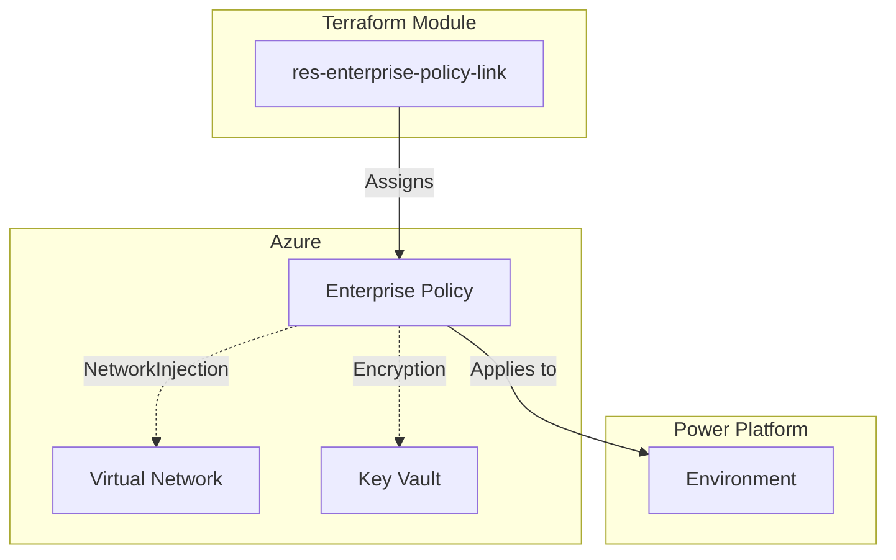

# Power Platform Enterprise Policy Resource Module

[](https://www.terraform.io/)
[](https://powerplatform.microsoft.com/)

> **PPCC25 Demo Module** - Part of "Enhancing Power Platform Governance Through Terraform: Embracing Infrastructure as Code" session

This Terraform module creates and manages **Power Platform Enterprise Policy assignments** following Azure Verified Module (AVM) best practices. It enables Infrastructure as Code governance for VNet integration and encryption policies in Power Platform environments.

## 🎯 Key Features

- **🔐 VNet Integration**: Assign NetworkInjection policies for private connectivity
- **🔒 Data Encryption**: Apply customer-managed key encryption policies  
- **🛡️ Security-First**: OIDC authentication, no hardcoded secrets
- **📋 AVM Compliant**: Follows Azure Verified Module specifications
- **🧪 Fully Tested**: Comprehensive test coverage with 20+ assertions
- **📖 Educational**: Clear examples for learning Infrastructure as Code

## 🚀 Quick Start

### NetworkInjection Policy Example

```hcl
module "vnet_policy" {
  source = "../res-enterprise-policy-link"
  
  environment_id = "12345678-1234-5678-9abc-123456789012"
  policy_type    = "NetworkInjection"
  system_id      = "/regions/unitedstates/providers/Microsoft.PowerPlatform/enterprisePolicies/vnet-policy-id"
}
```

### Encryption Policy Example

```hcl
module "encryption_policy" {
  source = "../res-enterprise-policy-link"
  
  environment_id = "12345678-1234-5678-9abc-123456789012"
  policy_type    = "Encryption"
  system_id      = "/regions/unitedstates/providers/Microsoft.PowerPlatform/enterprisePolicies/encryption-policy-id"
  
  # Optional: Customize timeouts for large environments
  timeouts = {
    create = "15m"
    delete = "15m"
  }
}
```

## 🏗️ Architecture



## 📋 Prerequisites

### Azure Requirements
- Azure enterprise policy resource (pre-created)
- Appropriate Azure RBAC permissions
- For NetworkInjection: VNet with subnet delegation
- For Encryption: Azure Key Vault with proper configuration

### Power Platform Requirements
- Target Power Platform environment (existing)
- Power Platform admin or environment admin permissions
- For Encryption: Managed environment configuration

### Authentication
- OIDC authentication configured for both Azure and Power Platform
- Service principal with enterprise policy assignment permissions

## 🔧 Policy Types

| Policy Type | Purpose | Prerequisites | Use Cases |
|-------------|---------|---------------|----------|
| `NetworkInjection` | VNet integration | VNet, subnet delegation | Private connectivity, hybrid scenarios |
| `Encryption` | CMK encryption | Key Vault, managed env | Data protection, compliance |

## 📊 Governance Benefits

- **Consistency**: Standardized policy assignment across environments
- **Auditability**: Full Infrastructure as Code audit trail
- **Version Control**: Policy changes tracked in Git
- **Automation**: Integrate with CI/CD pipelines
- **Compliance**: Meet enterprise governance requirements