# 📚 Power Platform Terraform Documentation

Welcome to the Power Platform Governance with Terraform documentation! This guide will help you transition from ClickOps to Infrastructure as Code.

## 🗺️ Documentation Map

### 🎓 New to Terraform + Power Platform?
Start with our **tutorials** for step-by-step learning:
1. **[Getting Started](tutorials/01-getting-started.md)** - Set up your environment and deploy your first configuration (20 min)
2. **[Working with DLP Policies](tutorials/02-first-dlp-policy.md)** - Export, create, and onboard DLP policies (30 min)
3. **[Environment Groups & Azure Integration](tutorials/03-environment-management.md)** - Provision environment groups and extend with Azure VNet (40 min)

### 🔧 Ready to Work?
Use our **how-to guides** for specific tasks:
- **[Setup Guide](guides/setup-guide.md)** - Complete environment setup
- **[DLP Policy Management](guides/dlp-policy-management.md)** - Create and manage DLP policies
- **[Migrate from ClickOps](guides/migrate-from-clickops.md)** - Transition existing configurations
- **[Troubleshooting](guides/troubleshooting.md)** - Fix common issues

### 📖 Need Details?
Check our **reference** documentation:
- **[Configuration Catalog](reference/configuration-catalog.md)** - All available configurations explained
- **[Module Reference](reference/module-reference.md)** - Detailed module parameters
- **[Common Patterns](reference/common-patterns.md)** - Reusable patterns and examples
- **[GitHub Actions Versions](reference/github-actions-versions.md)** - Action version tracking (maintainers)

### 💡 Want to Understand?
Read our **explanations** for deeper insights:
- **[Why Infrastructure as Code?](explanations/why-infrastructure-as-code.md)** - Benefits for Power Platform
- **[Architecture Decisions](explanations/architecture-decisions.md)** - Key design choices
- **[Known Limitations](explanations/known-limitations.md)** - Platform constraints and workarounds

## 🚀 Quick Links

| I want to...                          | Start here                                         |
| -------------------------------------- | -------------------------------------------------- |
| Set up my first deployment             | [Getting Started Tutorial](tutorials/01-getting-started.md) |
| Work with DLP policies                 | [DLP Policies Tutorial](tutorials/02-first-dlp-policy.md) |
| Manage DLP policies in production      | [DLP Policy Management Guide](guides/dlp-policy-management.md) |
| Create environment groups              | [Environment Groups Tutorial](tutorials/03-environment-management.md) |
| Understand the architecture            | [Architecture Decisions](explanations/architecture-decisions.md) |
| Find a specific configuration          | [Configuration Catalog](reference/configuration-catalog.md) |
| Fix an error                           | [Troubleshooting Guide](guides/troubleshooting.md) |

## 📊 Configuration Quick Reference

| Configuration | Purpose | Complexity | Deployment Time |
|--------------|---------|------------|----------------|
| `utl-export-connectors` | Export connector list | ⭐ Simple | 2 min |
| `utl-export-dlp-policies` | Export existing DLP policies | ⭐ Simple | 2 min |
| `res-dlp-policy` | Create/update DLP policies | ⭐⭐ Easy | 5 min |
| `res-environment` | Provision single environment | ⭐⭐ Easy | 5-10 min |
| `res-environment-settings` | Configure environment settings | ⭐⭐⭐ Medium | 2 min |
| `ptn-environment-group` | Provision environment group (Dev/Test/Prod) | ⭐⭐⭐⭐ Advanced | 15-20 min |
| `ptn-azure-vnet-extension` | Add Azure VNet integration | ⭐⭐⭐⭐ Advanced | 5-10 min |

**📖 Complete catalog**: [Configuration Catalog](reference/configuration-catalog.md)

## 🎯 Recommended Learning Path

### For Beginners

```mermaid
graph TD
    A[📖 Getting Started Tutorial] --> B[🛡️ DLP Policies Tutorial]
    B --> C[🌍 Environment Groups Tutorial]
    C --> D[📚 How-to Guides]
    D --> E[🚀 Production Deployment]
```

### For Experienced Users
1. Review [Configuration Catalog](reference/configuration-catalog.md)
2. Explore [Common Patterns](reference/common-patterns.md)
3. Check [Known Limitations](explanations/known-limitations-and-platform-constraints.md)
4. Dive into specific [How-to Guides](guides/)

## ❓ Need Help?

- **🐛 Found an issue?** [Report it here](https://github.com/rpothin/ppcc25-terraform-power-platform-governance/issues)
- **💬 Have questions?** [Start a discussion](https://github.com/rpothin/ppcc25-terraform-power-platform-governance/discussions)
- **📧 Direct feedback?** Contact [Raphael Pothin](https://github.com/rpothin)
