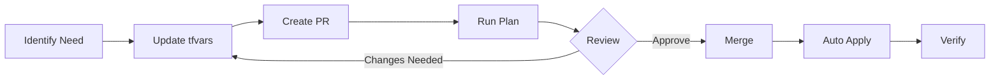

# Migrate from ClickOps to Infrastructure as Code


**Purpose**: Step-by-step guide to transition from manual Power Platform management to Infrastructure as Code  
**Audience**: Teams currently managing Power Platform through the Admin Center  
**Time**: 2-4 hours for initial migration

---

## Overview

This guide helps you transition from manual "ClickOps" administration to Infrastructure as Code (IaC) for Power Platform governance. You'll learn how to inventory existing resources, export configurations, and manage them with Terraform.

## Why Migrate?

### Current Pain Points with ClickOps

- **No Audit Trail**: Who changed what and when?
- **Configuration Drift**: Environments diverge over time
- **Manual Errors**: Typos, forgotten steps, inconsistencies
- **No Testing**: Changes go straight to production
- **Difficult Rollback**: Can't easily undo changes
- **Poor Documentation**: Tribal knowledge only

### Benefits of Infrastructure as Code

- **Version Control**: Every change tracked in Git
- **Peer Review**: Pull request workflows
- **Testing**: Validate before applying
- **Rollback**: Revert to any previous state
- **Documentation**: Code IS documentation
- **Repeatability**: Same result every time

---

## Prerequisites

Before starting migration:

- [ ] **Complete [Getting Started Tutorial](../tutorials/01-getting-started.md)**
- [ ] **Admin access** to Power Platform and Azure
- [ ] **Read-only period** - Plan a change freeze during migration
- [ ] **Backup plan** - Document current state before starting
- [ ] **Team alignment** - Everyone understands the new process

---

## Migration Strategy

### Recommended Approach: Phased Migration

**Phase 1**: Setup infrastructure (1 hour)
**Phase 2**: Inventory and export (30 minutes)
**Phase 3**: Migrate DLP policies (1 hour)
**Phase 4**: Migrate environments (1-2 hours)
**Phase 5**: Ongoing operations (continuous)

### Alternative: Big Bang Migration

Not recommended but possible if you have:
- Small tenant (< 10 environments, < 5 DLP policies)
- Planned maintenance window
- Experienced team
- Good backup strategy

---

## Phase 1: Setup Infrastructure

### Goal: Get Terraform and automation working

1. **Run the automated setup**:
   ```bash
   git clone https://github.com/YOUR-USERNAME/ppcc25-terraform-power-platform-governance.git
   cd ppcc25-terraform-power-platform-governance
   cp config.env.example config.env
   nano config.env  # Set GITHUB_OWNER and GITHUB_REPO
   ./setup.sh
   ```

2. **Verify setup works**:
   ```bash
   # Test with a simple export
   # GitHub Actions → Run workflow
   # Configuration: utl-export-connectors
   # This should complete successfully
   ```

3. **Document current authentication**:
   - Note current admin accounts
   - Document any automation using service accounts
   - Plan transition timeline

✅ **Success Criteria**: Can successfully deploy `utl-export-connectors` configuration

---

## Phase 2: Inventory and Export

### Goal: Understand what you have

**Step 1: Export DLP Policies**

```bash
# Deploy the export utility
# GitHub Actions → Terraform Plan and Apply
# Configuration: utl-export-dlp-policies
# Apply: Yes
```

This creates a JSON file with ALL your DLP policies.

**Step 2: Download and Review**

1. Download the workflow artifact
2. Review the JSON file
3. Create an inventory spreadsheet:

```
| Policy Name | Environments | Connectors | Action Rules | Notes |
|-------------|--------------|------------|--------------|-------|
| Finance DLP | 3 envs       | 15 allowed | SQL restricted | Complex |
| HR Policy   | 2 envs       | 10 allowed | None          | Simple |
```

**Step 3: Export Connectors**

```bash
# Deploy connector export
# Configuration: utl-export-connectors
```

This gives you the complete list of available connectors with IDs.

**Step 4: Document Environments**

In Power Platform Admin Center:
1. Go to Environments
2. For each environment, document:
   - Name and ID
   - Type (Production, Sandbox, etc.)
   - Region
   - Dataverse (Yes/No)
   - Security groups (if any)
   - Current DLP policy assignments

✅ **Success Criteria**: Complete inventory of all resources

---

## Phase 3: Migrate DLP Policies

### Goal: Manage DLP policies with Terraform

**Step 1: Prioritize Policies**

Start with the simplest policy first:

```
Priority Order:
1. Simple test policy (few connectors, one environment)
2. Department policies (medium complexity)
3. Tenant-wide baseline (complex, affects everything)
```

**Step 2: Generate Terraform Configuration**

For each policy:

```bash
cd configurations/utl-generate-dlp-tfvars
```

Create tfvars file:
```hcl
source_policy_name = "Your Policy Name from Export"
output_file_name   = "generated-policy.tfvars"
```

Deploy this configuration to generate the tfvars file.

**Step 3: Review and Customize**

Download the generated file and review:

```hcl
# Generated configuration will look like this
display_name = "Your Policy Name"
description = "Generated from existing policy"

default_connectors_classification = "Blocked"

business_connectors = [
  # All your current business connectors
]

# Review and customize:
# - Add comments explaining WHY connectors are allowed
# - Add endpoint filtering if needed
# - Add action rules for security
# - Update description
```

**Step 4: Test in Isolated Environment**

⚠️ **Important**: Don't replace production policies immediately!

```hcl
# First test: Create with a different name
display_name = "Your Policy Name - Terraform Test"

# Apply to a test environment only
environment_type = "OnlyEnvironments"
environments = ["<test-env-id>"]
```

Deploy and verify it works correctly.

**Step 5: Cutover Process**

When ready to replace the manual policy:

```hcl
# Option A: Different name (safest)
display_name = "Your Policy Name - IaC"

# Option B: Same name (requires manual deletion)
# 1. Delete old policy in Admin Center
# 2. Immediately apply Terraform configuration
# 3. Verify no gap in coverage
```

**Recommended: Cutover Checklist**

```markdown
- [ ] Generate Terraform configuration
- [ ] Review and test thoroughly
- [ ] Document all customizations
- [ ] Plan maintenance window (5-10 minutes)
- [ ] Notify affected users
- [ ] Backup current configuration (screenshot/export)
- [ ] Delete manual policy
- [ ] Apply Terraform configuration
- [ ] Verify policy is active
- [ ] Test with actual app creation
- [ ] Monitor for issues
- [ ] Update documentation
```

**Step 6: Repeat for All Policies**

Once comfortable with the process, migrate remaining policies one at a time.

✅ **Success Criteria**: All DLP policies managed by Terraform, no manual policies remain

---

## Phase 4: Migrate Environments

### Goal: Manage environments with Terraform

⚠️ **Important**: You CANNOT import existing environments into Terraform. You have two options:

### Option A: Manage New Environments Only (Recommended)

**Best for**:
- Existing production environments can't be disrupted
- Want to start fresh with IaC for new environments
- Prefer gradual adoption

**Process**:
1. Keep existing environments as-is (manual)
2. Create all NEW environments with Terraform
3. Gradually migrate apps/flows to new environments
4. Decommission old environments over time

**Example**:
```hcl
# New dev environment managed by Terraform
environment = {
  display_name = "Development - IaC Managed"
  environment_type = "Sandbox"
  description = "New IaC-managed development environment"
}

dataverse = {
  language_code = 1033
  currency_code = "USD"
}
```

### Option B: Recreate Existing Environments (Risky)

**Best for**:
- Non-production environments
- Environments with no critical data
- Test/development environments

**Process**:

1. **Document everything**:
   ```markdown
   Environment: Dev
   - Apps: 5 (list names)
   - Flows: 3 (list names)
   - Connections: 8 (list types)
   - Custom connectors: 2 (list names)
   - Solutions: 1 (list name)
   - Security groups: (list)
   ```

2. **Export all solutions**:
   - In Power Apps maker portal
   - Export each solution as .zip
   - Store in secure backup location

3. **Create Terraform configuration**:
   ```hcl
   environment = {
     display_name = "Dev - Same as before"
     environment_type = "Sandbox"
     location = "unitedstates"
     description = "Recreated with Terraform"
   }
   
   dataverse = {
     language_code = 1033  # Must match original
     currency_code = "USD"  # Must match original
   }
   ```

4. **During maintenance window**:
   - Delete old environment
   - Apply Terraform configuration
   - Reimport solutions
   - Recreate connections
   - Test everything

⚠️ **Warning**: This is disruptive! Only do this for non-critical environments.

### Hybrid Approach (Most Practical)

```
Existing Production Environments: Keep manual
New Environments: Terraform-managed
Test/Dev Environments: Consider recreation
```

✅ **Success Criteria**: All new environments created via Terraform

---

## Phase 5: Ongoing Operations

### Goal: Establish new operational processes

**New Workflow for Changes**:



**Day-to-Day Operations**:

1. **Making Changes**:
   ```bash
   # Edit tfvars file locally
   nano configurations/res-dlp-policy/tfvars/finance.tfvars
   
   # Commit and push
   git add .
   git commit -m "Update finance DLP policy - allow new connector"
   git push
   
   # Create PR for review
   gh pr create --title "Update Finance DLP" --body "Adding approved connector"
   
   # After approval, merge
   # GitHub Actions automatically applies changes
   ```

2. **Emergency Changes**:
   ```bash
   # For urgent fixes, you can still use workflow dispatch
   # But always update code afterward!
   
   # Run workflow manually
   # Then update tfvars to match
   git add configurations/res-dlp-policy/tfvars/finance.tfvars
   git commit -m "Sync code with emergency change"
   ```

3. **Regular Maintenance**:
   - Weekly: Review open PRs
   - Monthly: Check for drift (manual changes in Admin Center)
   - Quarterly: Review all policies and environments
   - Annually: Update Terraform and provider versions

**Drift Detection**:

Periodically check if anyone made manual changes:

```bash
# Export current state
# Configuration: utl-export-dlp-policies

# Compare with your tfvars files
# Look for differences

# If found:
# Option 1: Update tfvars to match (if change was approved)
# Option 2: Re-apply Terraform (if change was unauthorized)
```

**Team Training**:

1. **Train all admins on new process**:
   - No more changes in Admin Center
   - All changes via pull requests
   - How to review Terraform plans
   - Emergency procedures

2. **Update documentation**:
   - Runbooks
   - Onboarding guides
   - Architecture docs

3. **Establish governance**:
   - Who can approve changes
   - Review SLAs
   - Change windows
   - Rollback procedures

✅ **Success Criteria**: Team consistently uses IaC, no unauthorized manual changes

---

## Common Migration Challenges

### Challenge 1: "We have too many policies to migrate"

**Solution**: Start small, iterate

```
Week 1: Migrate 1 test policy
Week 2: Migrate 2-3 simple policies
Week 3: Migrate complex policies
Week 4: Baseline tenant-wide policies
```

### Challenge 2: "We can't have any downtime"

**Solution**: Blue-green deployment

```
1. Create new policy with "-v2" suffix
2. Test thoroughly
3. During maintenance window:
   - Delete old policy
   - Rename new policy (remove -v2)
   - Total downtime: < 30 seconds
```

### Challenge 3: "Policies keep conflicting"

**Solution**: Clear naming and ownership

```hcl
# Use prefixes to indicate precedence
display_name = "001-Global-Baseline"
display_name = "002-Finance-Override"
display_name = "003-Production-Restrictions"

# Document in description
description = "Global baseline - applies to all environments except those with more specific policies"
```

### Challenge 4: "Team resists change"

**Solution**: Show value early

```
1. Start with non-critical resources
2. Demonstrate version control benefits
3. Show easy rollback capability
4. Highlight reduced errors
5. Prove faster changes with automation
```

### Challenge 5: "Lost manual changes during migration"

**Solution**: Comprehensive inventory

```
Before ANY migration:
1. Full export of all resources
2. Screenshots of all settings
3. Documentation of non-obvious configurations
4. Backup of solutions and apps
5. List of all customizations
```

---

## Rollback Plan

If migration fails, you need a quick rollback:

### Before Migration

1. **Export all current policies**:
   - Use `utl-export-dlp-policies`
   - Store JSON safely

2. **Document all environments**:
   - Settings
   - Security groups
   - Custom configurations

3. **Screenshot everything**:
   - Admin Center views
   - Policy configurations
   - Environment settings

### During Migration Issues

**If Terraform fails**:
```bash
# Don't panic! Manual policies still exist
# Just don't delete them until Terraform succeeds

# Fix Terraform configuration
# Try again
```

**If policy is deleted but Terraform fails**:
```bash
# Use exported JSON to recreate manually
# This is why we export first!

# Then fix Terraform and try again
```

### Rollback Procedure

```bash
# 1. Remove Terraform-managed resources
terraform destroy -var-file="tfvars/problematic.tfvars"

# 2. Recreate manual resources from backups
# Use Admin Center with exported JSON as reference

# 3. Document what went wrong
# Fix before trying again

# 4. Update timeline and communicate
```

---

## Success Metrics

Track these to measure migration success:

### Technical Metrics

- **Coverage**: % of resources managed by IaC
- **Drift**: Number of unauthorized manual changes per month
- **Deployment Success**: % of successful Terraform applies
- **Time to Deploy**: Average time for policy changes
- **Rollback Rate**: How often you need to rollback

### Operational Metrics

- **Change Lead Time**: Time from request to deployment
- **Review Time**: Time to review and approve changes
- **Error Rate**: Deployment errors per month
- **Audit Completeness**: % of changes with full audit trail

### Team Metrics

- **Team Adoption**: % of team using IaC consistently
- **Training Completion**: % of team trained
- **Satisfaction**: Team satisfaction with new process

**Target Goals**:
```
Coverage: 100% of new resources
Drift: < 1 unauthorized change per month
Deployment Success: > 95%
Time to Deploy: < 10 minutes
Change Lead Time: < 24 hours
Team Adoption: 100%
```

---

## Post-Migration Best Practices

### 1. Continuous Monitoring

```bash
# Weekly drift check
# Run exports and compare with IaC

# Monthly policy review
# Are policies still appropriate?

# Quarterly security audit
# Review connector permissions
```

### 2. Documentation Maintenance

```markdown
Keep these updated:
- Architecture diagrams
- Runbooks
- Policy rationale
- Contact lists
- Emergency procedures
```

### 3. Regular Training

```
- New team member onboarding
- Quarterly refresher sessions
- Lunch-and-learns on advanced topics
- Share lessons learned
```

### 4. Process Improvement

```
- Collect feedback from team
- Measure metrics monthly
- Identify bottlenecks
- Iterate on workflows
- Celebrate successes
```

---

## Next Steps

After completing migration:

1. **[DLP Policy Management](dlp-policy-management.md)** - Advanced DLP patterns
2. **[Architecture Decisions](../explanations/architecture-decisions.md)** - Understand the design
3. **[Common Patterns](../reference/common-patterns.md)** - Reusable configurations

---

## Getting Help

**Migration-specific questions**:
- [GitHub Discussions](https://github.com/rpothin/ppcc25-terraform-power-platform-governance/discussions)
- Tag your questions with "migration"

**General troubleshooting**:
- [Troubleshooting Guide](troubleshooting.md)

**Community experiences**:
- Share your migration story!
- Help others by documenting your journey
